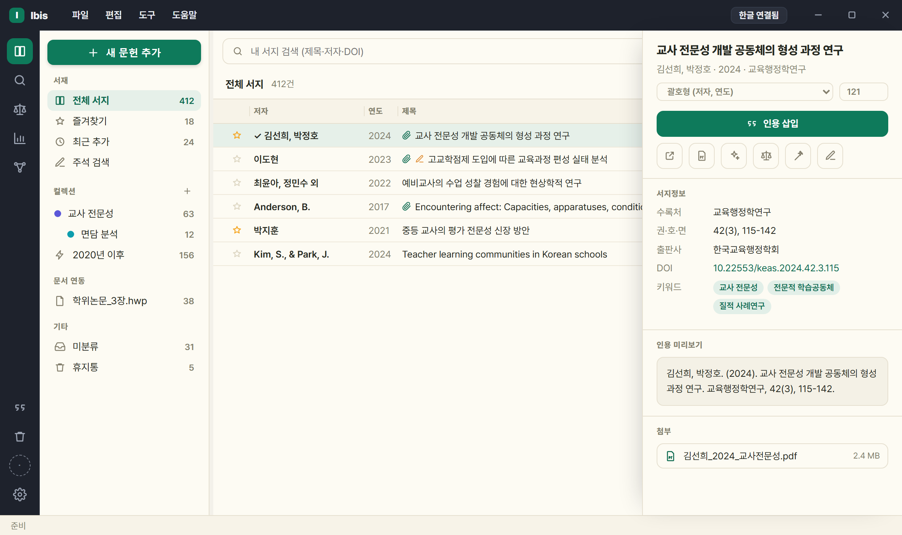
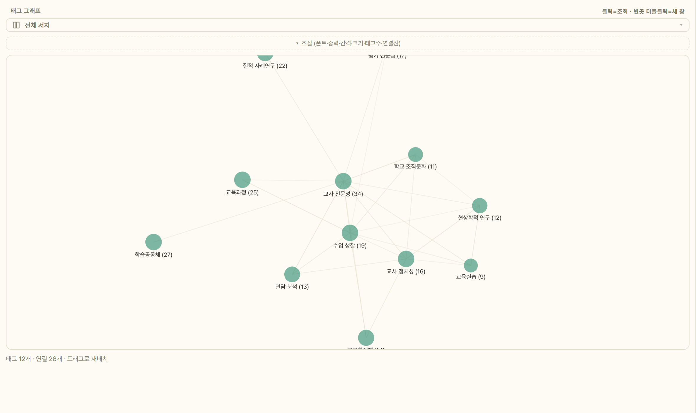
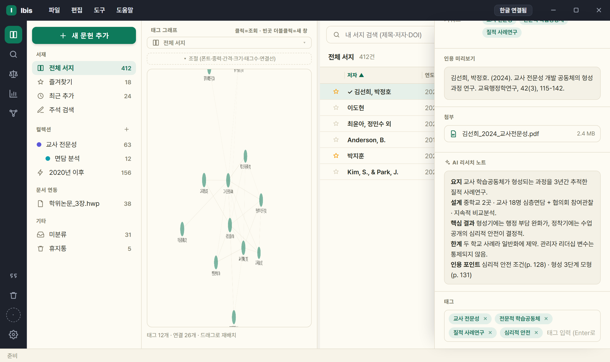
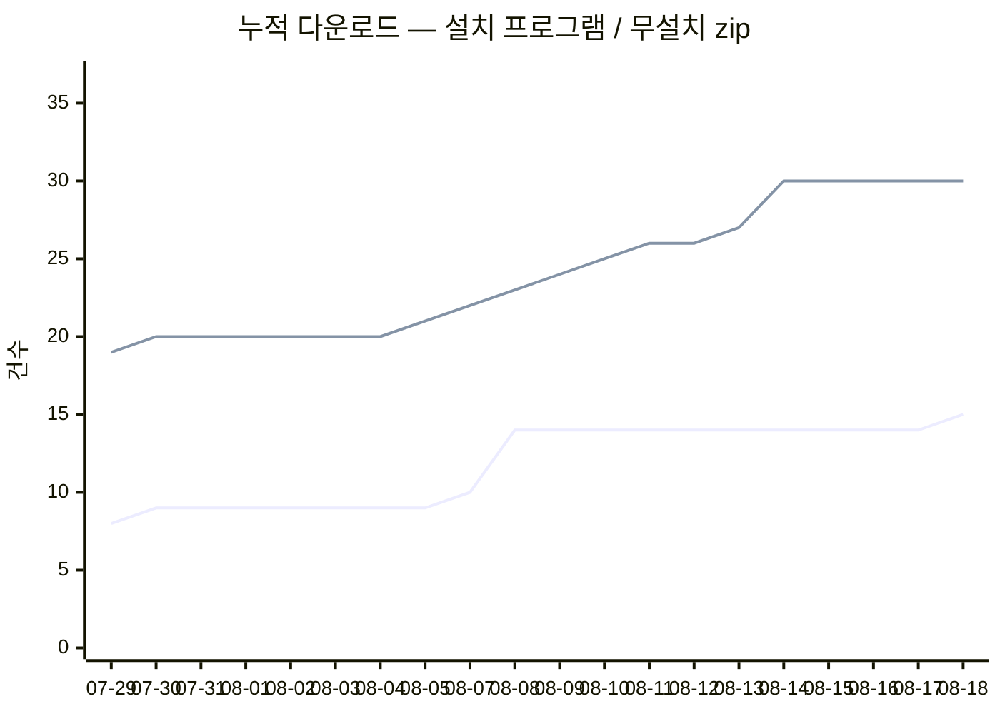

# Ibis — 한글·Word를 위한 서지·인용 관리자

**Ibis**(아이비스)는 한국 연구자를 위한 **서지·인용 관리자**입니다.
**국내 학술 검색 → 원문 확보 → 읽기·AI 분석 → 태그 그래프 → 본문 인용**까지 한 프로그램에서 끝냅니다.
KCI·국립중앙도서관 검색, 도서관 교외접속 경유 원문 확보, 인앱 PDF 뷰어·주석, 논문 근거 AI 대화,
태그 네트워크, 그리고 아래아한글(HWP)·MS Word 본문 인용(CWYW) —
**한국 연구자의 실제 작업 흐름에 맞춰 설계**했습니다.

 &nbsp; 

Ibis 는 한 사람이 만드는 연구 도구이며 **개인·학술·연구·교육 목적 무료**입니다.

> 이 저장소는 **배포 전용**입니다. 소스 코드는 비공개로 관리되며,
> 버그 제보·기능 제안은 [Issues](../../issues)로 남겨주세요.
> 소개 페이지는 **[ibis.dodaseo.cc](https://ibis.dodaseo.cc)** 에 있습니다.

좌측 컬렉션·스마트 컬렉션, 중앙 서지 목록, 우측 상세(서지정보·인용 미리보기·첨부). 테마 16종·글꼴 선택·항상 위 고정 지원.

## 다운로드 · 설치

두 가지 방식 중 편한 쪽을 고르세요.

- **설치본(권장)**: [Releases](../../releases)에서 `Ibis-<버전>-setup.exe`를 내려받아 실행하면 설치됩니다(자동 업데이트 확인).
- **무설치 zip**: `Ibis-<버전>-win64.zip`을 내려받아 압축을 풀고 `Ibis.exe`를 실행합니다 — 설치 과정이 없습니다.

처음 실행 시 Windows SmartScreen 경고가 뜨면 **"추가 정보" → "실행"**을 누르세요 — 코드 서명이 없는
베타 배포판에 나타나는 **표준 안내이며 보안 위험이 아닙니다**(불안하면 릴리스의 SHA-256 해시로 대조).
정식 배포 시 코드 서명을 적용해 이 경고를 완화할 계획입니다.

**요구 사항** · Windows 10/11 (64비트) · 한글 2022/2024 또는 MS Word(본문 인용을 쓸 때만 — 없어도 검색·원문 확보·PDF 뷰어·AI·그래프는 그대로 동작)

## 5분 빠른 시작

| 단계 | 하는 일 |
|---|---|
| ① 연결 | 한글(또는 Word) 문서를 열어 둔 뒤, 우측 상단 **모드 배지**를 눌러 연결할 문서를 고릅니다. 열려 있지 않으면 **독립 모드**로 서지만 관리할 수 있습니다 |
| ② 검색 | 상단 검색창에 제목·저자·**DOI**를 입력 — KCI·국립중앙도서관·Crossref 등에서 서지를 찾아옵니다(키 발급 불필요) |
| ③ 수집 | 결과에서 원하는 문헌을 **내 서지에 추가**합니다 |
| ④ 인용 | 문서에서 인용할 위치에 커서를 두고, 문헌을 골라 **인용 삽입** — `(홍길동, 2024)` |
| ⑤ 갱신 | **참고문헌 갱신**을 누르면 문서 끝에 참고문헌 목록이 서식대로 생성·정렬됩니다 |

자세한 흐름은 **[사용 설명서(USAGE)](docs/USAGE.md)**, 막히면 **[FAQ·문제 해결](docs/FAQ.md)**을 보세요.

## 주요 기능

**수집**
- 국내 **KCI · 국립중앙도서관 · ScienceON**, 해외 **OpenAlex · Crossref · ERIC · arXiv · Semantic Scholar**
  — 국내·해외 각각 **통합 검색**이 병렬 질의 후 중복을 합칩니다. KCI·국립중앙도서관은 **설치 직후부터 바로** 쓰입니다
- 「그리고」·「또는」 으로 조건을 엮는 **다중 조건 고급검색**(소스별 전용 필드 지원, 적용 안 된 조건은 이유를 표시)
- DOI 붙여넣기 즉시 서지화 · 6개 형식 가져오기(RIS·BibTeX·CSL-JSON·EndNote(.enw)·RefWorks·Tab) · 내보내기(CSL-JSON·BibTeX)
- **서지 직접 추가(＋)**: 서식 인용문 붙여넣기 파싱, DOI 없는 자료는 유형별 폼으로 수동 입력
- 무료 공개(OA) PDF 자동 확보 및 첨부, 도서관 교외접속(프록시) 경유 열기

**정리**
- 컬렉션(하위 계층·색상)과 ⚡스마트 컬렉션(조건 자동 분류), 태그, ★즐겨찾기, 휴지통
- **내 서지 광역 전문검색(FTS)** — 제목·저자·수록처·태그·키워드·AI 요약·초록까지 한 번에 검색
- 중복 문헌 자동 탐지·병합(첨부·태그·즐겨찾기 승계)
- 복수 선택(드래그·Ctrl·Shift) + 우클릭 일괄 작업 + 드래그앤드롭 분류

**인용·참고문헌**
- 한글 누름틀/Word 콘텐츠 컨트롤 기반 인용 — 문서를 다시 열어도, 파일명을 바꿔도, 다른 PC로 옮겨도 안전
- **인용 형태 5종** — 괄호형 `(저자, 연도)` · 서술형 `저자(연도)`(복수 문헌도 지원) · 연도만 · **서지에만 표시** · **표기 생략(쪽만)** + 쪽수 지정 · 병렬 인용(자동 병합)
- **인용 편집 창** — 문서의 인용을 **나오는 순서대로** 모아 보고, **행을 클릭하면 한글이 그 자리로 이동**합니다.
  표기 방식·쪽·병렬 구성 문헌을 그 자리에서 고치고, 갱신하면 표기가 달라질 인용에는 배지가 붙습니다
- **직접 고친 인용은 덮어쓰기 전에 묻습니다** — '유지'(이후 갱신에서 제외) / '정식 표기로 되돌리기'
- 참고문헌 자동 생성: 새 페이지 분리, 내어쓰기, 국문·영문 혼합 정렬, 학회별 스타일.
  목록은 **테두리 없는 표** 안에 살아 갱신이 원고를 건드릴 수 없습니다(겉모양은 일반 문단과 같음 —
  기존 문서는 백업을 만든 뒤 **한 번만** 자동 이행)
- **언어×유형 인용 서식** — 유형(학술지·단행본·학위논문·법령 등)×언어(국/영)별로 제목·수록처 강조를 없음/기울임/볼드/밑줄로 지정(국문 단행본 밑줄 등 국내 관례), 언어별 따옴표까지
- **문서별 스타일** — 문서마다 스타일을 독립 저장하고, 바꾸면 본문 인용·참고문헌을 즉시 재렌더

**나누기 — 컬렉션 공유**
- **파일로 건네기(`.ibiscol`)** — 컬렉션을 하위까지 통째로 파일 하나로. 서버를 안 거치고 오프라인에서도 됩니다
- **클라우드 공유(베타)** — 서버에 올려 동료와 **계속 맞춰 갑니다**. 구글 로그인 하나(별도 가입 없음, 받는 개인정보는 이메일 1개) ·
  지명 초대 · 활동 기록 · 자동 동기화 · 베타 할당 1인 5MB
- 어느 쪽이든 **PDF 원문·개인 메모·즐겨찾기는 나가지 않습니다.** 하이라이트와 메모는 파일이 아니라 **위치와 문장**으로 가서,
  받는 쪽이 그 원문을 확보해 열면 **판본이 달라 쪽수가 어긋나도** 문장으로 다시 찾아 붙습니다
- **서지 교정은 칸 단위로 오갑니다** — 내가 손대지 않은 칸만 받고 내가 고친 칸은 지킵니다. 같은 칸을 둘이 다르게 고친 경우에만
  나중 것으로 맞추고 무엇이 덮였는지 알립니다
- ⚠ 베타 한계 — 컬렉션 **이름·색·정렬 순서**는 전파되지 않습니다(참가자마다 다르게 굳는 것을 막으려고 일부러 뺐습니다)

**내 서재 동기화 (여러 PC · 베타)**
- 컬렉션 공유가 *동료와* 나누는 것이라면, 이쪽은 **같은 구글 계정의 내 다른 PC** 와 **서재 전체**를 맞춥니다(⚙설정 › 클라우드)
- 문헌·컬렉션 구성은 물론 **개인 메모·즐겨찾기·초록까지** 갑니다 — 받는 쪽이 나 자신이므로. **PDF 원문 파일은 올라가지 않습니다**
- 다른 PC 에서 이미 켰다면 **그것을 먼저 받아 합칩니다.** 한쪽에서 지운 문헌·컬렉션은 다른 PC 에서도 정리됩니다
  (문헌은 휴지통으로, 컬렉션이 없어져도 그 안의 문헌은 서재에 남습니다)
- **남과 나눌 수 없습니다**(서버가 초대를 거절합니다). PDF 파일까지 맞추려면 라이브러리 폴더를 클라우드 폴더에 두는 방식을 **함께** 쓰세요

**연구 도우미**
- **AI 논문 요약**: 첨부 PDF·초록을 내 구독(Claude Code·Antigravity CLI) 또는 내 API 키(Anthropic·OpenAI·Gemini)로 요약 —
  요약·분류 태그·논문 키워드가 자동 저장됩니다 (별도 과금 없음, 본인 자원 사용).
  CLI 는 설정에서 **설치 → 로그인 → 확인** 3단계로 안내하며, 설치·로그인은 콘솔 창에서 진행됩니다.
  일괄 요약은 **여러 건을 동시에** 돌립니다(⚙설정 › AI 의 [동시 실행] 1~5, 기본 3 — 올리면 사용량 한도에 그만큼 빨리 닿습니다)
- **AI 서지정보 채우기·원고 세칙 분석**: DOI·PDF로 부족한 서지 항목을 보완, 학술지 투고규정에서 인용 서식을 뽑아 스타일 초안 생성
- **태그 그래프 뷰**: 태그 사이 연결을 인터랙티브 네트워크 그래프로 탐색(줌·드래그·별도 창), 노드 클릭으로 관련 문헌 조회
- **AI 태그 정리**: 표기 변형 병합(버트토픽→BERTopic) · 번역쌍 병기 통합(LLM(거대언어모델)) · 과잉 일반 태그 삭제 제안
- **인앱 PDF 뷰어·주석**: 첨부 PDF를 앱 안에서 열어 하이라이트·밑줄·메모(단축키 H·U·N) — 주석 자동 저장·복원, 주석 모아보기·학술지 쪽번호 인식·주석 포함 인쇄.
  **본문 찾기 `Ctrl+F`** — 화면에 아직 없는 쪽까지, 띄어쓰기·줄바꿈·대소문자를 무시하고 찾습니다
- **논문 근거 AI 대화**: PDF 창 오른쪽 [대화] 탭에서 **지금 읽는 논문 한 편만**을 근거로 묻고 되묻기 —
  답변의 쪽 표기를 누르면 그 근거 자리로 이동하며, **쪽 번호는 앱이 원문에서 되찾아 확정**합니다.
  남길 답만 [보관]하면 '주석 검색'에도 함께 걸립니다

태그 그래프: 같은 문헌에 함께 달린 태그를 연결선으로 그려 주제 군집을 훑습니다. 노드를 클릭하면 그 태그의 문헌이 목록에 뜹니다.

AI 리서치 노트: 첨부 PDF 를 읽어 요지·설계·핵심 결과·한계·인용 포인트(쪽수)를 정리하고 태그를 자동 생성합니다.

## 데이터는 어디에 있나요?

- 서지 라이브러리·첨부·설정은 **내 PC에만** 저장됩니다(클라우드 전송 없음).
- 라이브러리 폴더를 OneDrive 등 동기화 폴더에 두면 여러 PC에서 이어서 쓸 수 있습니다.
  라이브러리 새로 만들기·열기·사본 저장(백업)은 **도구 › 라이브러리**에서 합니다.
- 문서 안에는 인용 필드와 문서 식별자만 들어가고, 서지 원본은 항상 내 라이브러리가 기준입니다.
- 처음 실행하면 선택적 온보딩 마법사가 라이브러리 위치·무료 원문 조회용 이메일·AI 설정을 안내합니다(전부 건너뛸 수 있으며, 기존 사용자에게는 뜨지 않습니다).

## 학술 DB 이용 안내 (중요)

- Ibis의 **PDF 자동 확보는 합법적 무료 공개본(OA)** 경로(arXiv·Unpaywall·Semantic Scholar)만 사용합니다.
- 구독 DB(DBpia·KISS·해외 출판사 등) 원문은 자동으로 내려받지 않습니다 —
  **"도서관 경유로 열기"는 기관 인증 창을 열어 주는 것까지만** 수행하며, 열람·다운로드는 사용자가 직접 합니다.
- 대학 도서관과 DB 제공사에 따라 **스크립트·AI 에이전트 등 자동화 도구를 통한 접속·대량 다운로드를
  이용약관으로 제한·금지**하는 경우가 있으며, 위반 시 계정 정지나 기관 IP 차단 등의 불이익이 있을 수 있습니다.
- 도서관 경유 기능은 **소속 기관의 라이선스 정책을 확인한 뒤, 사용자 본인 책임 하에** 이용하세요.

## 베타 안내

- 베타 기간에는 데이터 구조가 바뀔 수 있습니다. 중요한 문서는 백업 후 사용을 권합니다.
- **2026.8.2 로 올리면 기존 문서의 참고문헌이 한 번 이행됩니다** — 문서를 열 때 안내가 뜨고,
  `.hwp` 백업을 만든 뒤 옮깁니다(문서가 저장돼 있어야 합니다). 겉모양은 달라지지 않습니다 → [FAQ](docs/FAQ.md)
- 알려진 사항: SmartScreen 경고(위 참고), 한글 연동 시 보안 모듈 팝업·누름틀 팝업 가능 → [FAQ](docs/FAQ.md)
- 피드백 환영: [Issues](../../issues)에 재현 방법과 함께 남겨주시면 빠르게 반영합니다.

## 앞으로 추가될 기능

지금 쓰실 수 있는 것은 위 **주요 기능**에 있는 것 전부입니다. 아래는 준비 중인 것으로,
일정은 확정이 아닙니다 — 순서가 바뀌거나 방식이 달라질 수 있습니다.

| 준비 중 | 무엇이 달라지나 |
|---|---|
| **해외 DB 원문 확보** | 지금은 국내 DB(RISS 경유)까지 자동입니다. 해외 구독 저널도 도서관 경유로 이어 줍니다. |
| **AI 발견** | 인용 그래프를 바탕으로 관련 문헌을 추천합니다. (논문과 대화하는 기능은 **2026.8.0 에서 출시**됐습니다 — 위 주요 기능 참고.) |
| **PDF 개인 클라우드 보관** | 서재 동기화는 서지·주석까지입니다(**2026.8.9 출시** — 위 참고). PDF 원문 파일까지 서버에 두는 것은 용량이 자릿수부터 달라(실측 2.5GB/인) 유료 단계의 과제로 둡니다. 그때까지는 라이브러리 폴더를 클라우드 폴더에 두는 방식과 **함께** 쓰시면 됩니다. |
| **macOS 판** | 검색·원문 확보·PDF 뷰어·AI·서지 관리는 이식 가능하지만 **한글 본문 인용은 불가**합니다(한글 자동화가 Windows 전용). 수요를 보고 판단합니다. |

바라는 기능이나 불편한 점은 [이슈](../../issues/new)로 남겨 주세요. 우선순위에 반영합니다.

---

## 사용 현황

<!-- DL-STATS:START -->
<!-- 이 블록은 .github/workflows/dl-stats.yml 이 매일 생성합니다. 직접 고치지 마세요. -->

최신 기록 **2026-08-18** · 누적 합계 **190건** (설치 15 · zip 30)

> 설치 프로그램은 **새로 설치한 사람**에 가깝고, zip 은 **인앱 업데이트**가 섞입니다.

자세한 표는 [stats/README.md](stats/README.md), 원본은 [stats/downloads.csv](stats/downloads.csv).

<!-- DL-STATS:END -->
