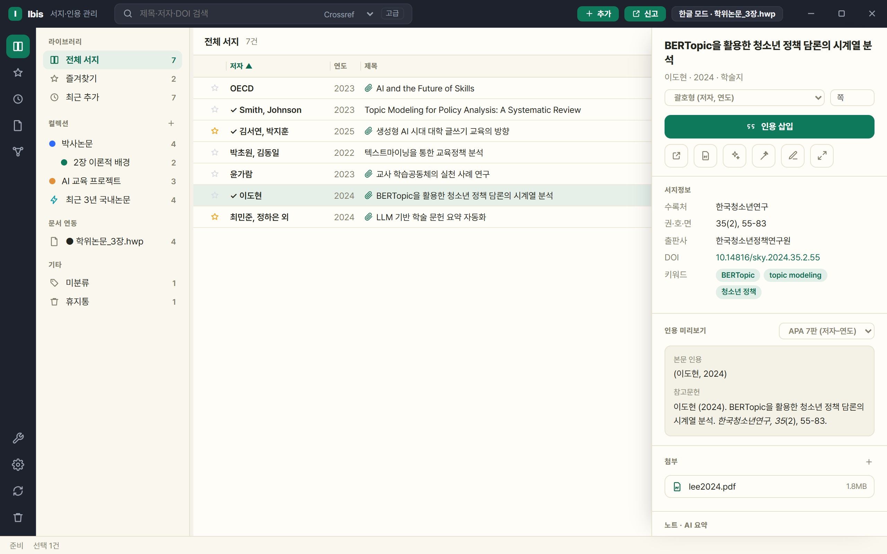
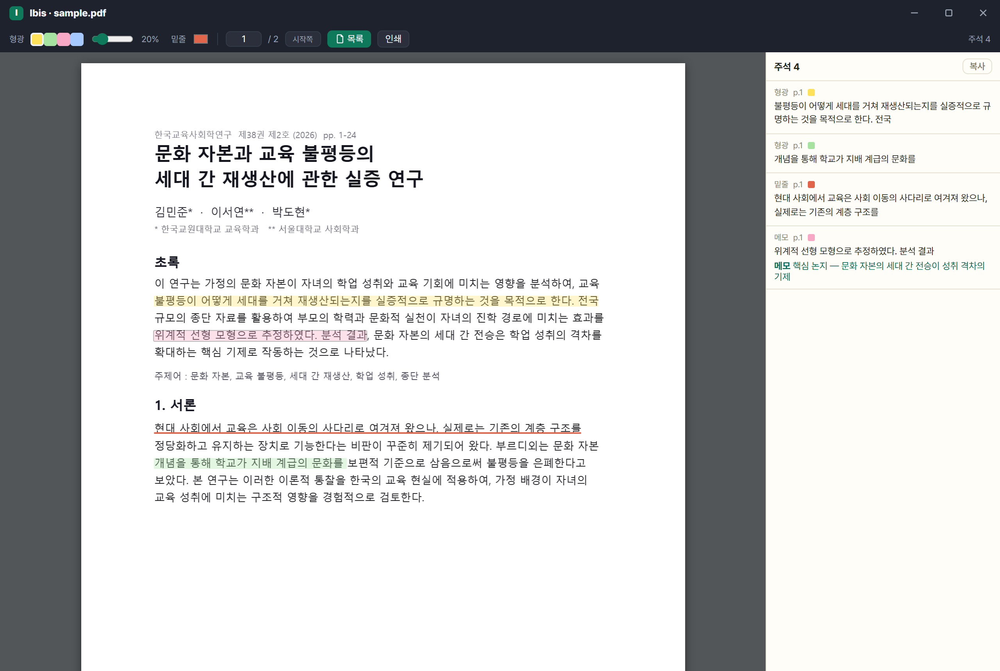

# Ibis — 한글·Word를 위한 서지·인용 관리자

**Ibis**(아이비스)는 아래아한글(HWP)과 MS Word를 위한 **서지·인용 관리자**입니다.
논문을 검색해 내 서지로 모으고, 클릭 한 번으로 문서에 인용을 삽입하면 참고문헌 목록이
학회 규정 서식으로 자동 생성·갱신됩니다. 국내 학술 DB(KCI·ScienceON)와 한글 누름틀,
국문·영문 혼합 서식까지 — **한국 연구자의 실제 작업 흐름에 맞춰 처음부터 설계**했습니다.

> 이 저장소는 **배포 전용**입니다. 소스 코드는 비공개로 관리되며,
> 버그 제보·기능 제안은 [Issues](../../issues)로 남겨주세요.

메인 화면: 좌측 컬렉션·스마트 컬렉션, 중앙 서지 목록, 우측 상세(서지정보·인용 미리보기·AI 요약). 콘텐츠 4색 테마 전환·항상 위 고정 지원.

## 다운로드 · 설치

두 가지 방식 중 편한 쪽을 고르세요.

- **설치본(권장)**: [Releases](../../releases)에서 `Ibis-<버전>-setup.exe`를 내려받아 실행하면 설치됩니다(자동 업데이트 확인).
- **무설치 zip**: `Ibis-<버전>-win64.zip`을 내려받아 압축을 풀고 `Ibis.exe`를 실행합니다 — 설치 과정이 없습니다.

처음 실행 시 Windows SmartScreen 경고가 뜨면 **"추가 정보" → "실행"**을 누르세요 — 코드 서명이 없는
베타 배포판에 나타나는 **표준 안내이며 보안 위험이 아닙니다**(불안하면 릴리스의 SHA-256 해시로 대조).
정식 배포 시 코드 서명을 적용해 이 경고를 완화할 계획입니다.

**요구 사항** · Windows 10/11 (64비트) · 한글 2022/2024(한글 연동 시) · MS Word(선택)

## 5분 빠른 시작

| 단계 | 하는 일 |
|---|---|
| ① 연결 | 한글(또는 Word) 문서를 열어 둔 뒤, 우측 상단 **모드 배지**를 눌러 연결할 문서를 고릅니다. 열려 있지 않으면 **독립 모드**로 서지만 관리할 수 있습니다 |
| ② 검색 | 상단 검색창에 제목·저자·**DOI**를 입력 — KCI·Crossref 등에서 서지를 찾아옵니다 |
| ③ 수집 | 결과에서 원하는 문헌을 **내 서지에 추가**합니다 |
| ④ 인용 | 문서에서 인용할 위치에 커서를 두고, 문헌을 골라 **인용 삽입** — `(홍길동, 2024)` |
| ⑤ 갱신 | **참고문헌 갱신**을 누르면 문서 끝에 참고문헌 목록이 서식대로 생성·정렬됩니다 |

자세한 흐름은 **[사용 설명서(USAGE)](docs/USAGE.md)**, 막히면 **[FAQ·문제 해결](docs/FAQ.md)**을 보세요.

## 주요 기능

**수집**
- KCI · ScienceON · Crossref · OpenAlex · Semantic Scholar · arXiv 통합 검색(⚡멀티 소스 동시)
- DOI 붙여넣기 즉시 서지화 · 6개 형식 가져오기(RIS·BibTeX·CSL-JSON·EndNote(.enw)·RefWorks·Tab) · 내보내기(CSL-JSON·BibTeX)
- **서지 직접 추가(＋)**: 서식 인용문 붙여넣기 파싱, DOI 없는 자료는 유형별 폼으로 수동 입력
- 무료 공개(OA) PDF 자동 확보 및 첨부, 도서관 교외접속(프록시) 경유 열기

**정리**
- 컬렉션(하위 계층·색상)과 ⚡스마트 컬렉션(조건 자동 분류), 태그, ★즐겨찾기, 휴지통
- **내 서지 광역 전문검색(FTS)** — 제목·저자·수록처·태그·키워드·AI 요약·초록까지 한 번에 검색
- 중복 문헌 자동 탐지·병합(첨부·태그·즐겨찾기 승계)
- 복수 선택(드래그·Ctrl·Shift) + 우클릭 일괄 작업 + 드래그앤드롭 분류

**인용·참고문헌**
- 한글 누름틀/Word 콘텐츠 컨트롤 기반 인용 — 문서를 다시 열어도, 파일명을 바꿔도, 다른 PC로 옮겨도 안전
- 괄호형 `(저자, 연도)` · 서술형 `저자(연도)` · 연도만 · 쪽수 지정 · 병렬 인용(자동 병합)
- 참고문헌 자동 생성: 새 페이지 분리, 내어쓰기, 국문·영문 혼합 정렬, 학회별 스타일
- **언어×유형 인용 서식** — 유형(학술지·단행본·학위논문·법령 등)×언어(국/영)별로 제목·수록처 강조를 없음/기울임/볼드/밑줄로 지정(국문 단행본 밑줄 등 국내 관례), 언어별 따옴표까지
- **문서별 스타일** — 문서마다 스타일을 독립 저장하고, 바꾸면 본문 인용·참고문헌을 즉시 재렌더

**연구 도우미**
- **AI 논문 요약**: 첨부 PDF·초록을 내 구독(Claude CLI·Antigravity CLI) 또는 내 API 키로 요약 —
  요약·분류 태그·논문 키워드가 자동 저장됩니다 (별도 과금 없음, 본인 자원 사용)
- **AI 서지정보 채우기·원고 세칙 분석**: DOI·PDF로 부족한 서지 항목을 보완, 학술지 투고규정에서 인용 서식을 뽑아 스타일 초안 생성
- **태그 그래프 뷰**: 태그 사이 연결을 인터랙티브 네트워크 그래프로 탐색(줌·드래그·별도 창), 노드 클릭으로 관련 문헌 조회
- **AI 태그 정리**: 표기 변형 병합(버트토픽→BERTopic) · 번역쌍 병기 통합(LLM(거대언어모델)) · 과잉 일반 태그 삭제 제안
- **인앱 PDF 뷰어·주석**: 첨부 PDF를 앱 안에서 열어 하이라이트·밑줄·메모(단축키 H·U·N) — 주석 자동 저장·복원, 주석 모아보기·학술지 쪽번호 인식·주석 포함 인쇄

인앱 PDF 뷰어(0.6.0): 형광펜·밑줄·메모 주석을 달고 우측 '주석 모아보기'로 한눈에 훑습니다.

## 데이터는 어디에 있나요?

- 서지 라이브러리·첨부·설정은 **내 PC에만** 저장됩니다(클라우드 전송 없음).
- 라이브러리 폴더를 OneDrive 등 동기화 폴더에 두면 여러 PC에서 이어서 쓸 수 있습니다.
  라이브러리 새로 만들기·열기·사본 저장(백업)은 **도구 › 라이브러리**에서 합니다.
- 문서 안에는 인용 필드와 문서 식별자만 들어가고, 서지 원본은 항상 내 라이브러리가 기준입니다.
- 처음 실행하면 선택적 온보딩 마법사가 라이브러리 위치·KCI/ScienceON·이메일·AI 설정을 안내합니다(전부 건너뛸 수 있으며, 기존 사용자에게는 뜨지 않습니다).

## 학술 DB 이용 안내 (중요)

- Ibis의 **PDF 자동 확보는 합법적 무료 공개본(OA)** 경로(arXiv·Unpaywall·Semantic Scholar)만 사용합니다.
- 구독 DB(DBpia·KISS·해외 출판사 등) 원문은 자동으로 내려받지 않습니다 —
  **"도서관 경유로 열기"는 기관 인증 창을 열어 주는 것까지만** 수행하며, 열람·다운로드는 사용자가 직접 합니다.
- 대학 도서관과 DB 제공사에 따라 **스크립트·AI 에이전트 등 자동화 도구를 통한 접속·대량 다운로드를
  이용약관으로 제한·금지**하는 경우가 있으며, 위반 시 계정 정지나 기관 IP 차단 등의 불이익이 있을 수 있습니다.
- 도서관 경유 기능은 **소속 기관의 라이선스 정책을 확인한 뒤, 사용자 본인 책임 하에** 이용하세요.

## 베타 안내

- 베타 기간에는 데이터 구조가 바뀔 수 있습니다. 중요한 문서는 백업 후 사용을 권합니다.
- 알려진 사항: SmartScreen 경고(위 참고), 한글 연동 시 보안 모듈 팝업·누름틀 팝업 가능 → [FAQ](docs/FAQ.md)
- 피드백 환영: [Issues](../../issues)에 재현 방법과 함께 남겨주시면 빠르게 반영합니다.

## 버전

| 버전 | 상태 | 비고 |
|---|---|---|
| 0.3.0 | 이전 배포판 | 첫 베타(Qt UI) · 핵심 워크플로(검색→수집→인용→참고문헌) |
| 0.4.x | 이전 배포판 | 새 웹 UI · 4테마 · 스마트 컬렉션 · 태그 그래프 뷰 · PDF 일괄 확보 · 휴지통 · AI 요약·서지 채우기 |
| 0.5.x | 이전 배포판 | SQLite 백엔드·광역 전문검색(FTS) · 언어×유형 인용 서식 · 문서별 스타일 · 서지 직접 추가 · 프레임리스 타이틀바·항상 위 고정 · 온보딩 · AI 폴백 |
| 0.6.0 | 이전 배포판 | 인앱 PDF 뷰어·주석(하이라이트·밑줄·메모) · 주석 모아보기 · 페이지 이동·쪽번호 인식 · 주석 포함 인쇄 |
| **v0.6.1** | **현재 배포판** | 마이너 수정(도구 창 폭 · 문제 신고 버튼 툴바 이동) |

전체 변경 내역은 각 [릴리스 노트](../../releases)를 참고하세요.
