# Ibis 사용 설명서

한국어로 연구하는 사람을 위한 **문헌 관리 앱**. **찾기 → 원문 확보 → 읽기·AI 분석 → 정리·태그 그래프 → 동료와 나누기** 까지 한 프로그램 안에서 합니다. 아래아한글·Word 본문 인용(CWYW)도 그중 한 기능입니다. 기준 버전 **2026.9.4**.

- 표기: `⚙설정` · `파일`·`편집`·`도구` 메뉴 · `새 문헌 추가` 는 화면의 실제 라벨입니다.
- 좌측 세로 아이콘 줄 = **레일**, 상단의 '○○ 모드 · 문서명' = **상태 배지**.
- 버전은 CalVer(`연.월.패치`) — `0.7.2` 다음이 `2026.7.0`·`2026.7.1`·`2026.7.2`·`2026.8.0`·`2026.8.1` 입니다.

## 목차

1. [시작하기 — 설치·실행·화면](#1-시작하기--설치실행화면)
2. [한글/Word 문서 연결](#2-한글word-문서-연결)
3. [문헌 검색·수집](#3-문헌-검색수집)
4. [본문 인용 삽입·재서식](#4-본문-인용-삽입재서식)
5. [참고문헌·인용 스타일](#5-참고문헌인용-스타일)
6. [서지 관리](#6-서지-관리)
7. [원문 확보·PDF 뷰어](#7-원문-확보pdf-뷰어)
8. [AI 기능](#8-ai-기능)
9. [설정·API 키](#9-설정api-키)

---

## 1. 시작하기 — 설치·실행·화면

### 1.1 요구 환경

- Windows 10/11.
- **본문 인용(CWYW)** 을 쓰려면 한글 2022/2024 또는 MS Word. 없어도 나머지 기능은 모두 동작합니다.
- 별도 런타임 설치 불필요(파이썬·라이브러리 모두 포함).

### 1.2 설치

[릴리스 페이지](https://github.com/dodaseo/ibis-releases/releases/latest)에서 **`Ibis-<버전>-setup.exe`** 를 받아 실행합니다. 관리자 권한이 필요 없고, 시작 메뉴·바탕화면 아이콘이 생기며 제어판에서 지웁니다.

- **설치 위치를 묻지 않습니다**(2026.8.10 부터) — `%LOCALAPPDATA%\Programs\Ibis` 에 설치됩니다. 인앱 업데이트가 이 폴더를 직접 교체하므로 쓰기 권한이 있는 자리여야 하는데, 예전에는 사용자가 `C:\Program Files` 를 고르면 업데이트가 깨졌습니다.
- 첫 실행 시 SmartScreen 경고(코드 서명 없음) → `추가 정보 → 실행`. 릴리스의 `.sha256` 으로 무결성 확인 가능.
- ⚠ 릴리스에 함께 있는 **`Ibis-<버전>-win64.zip` 은 앱이 업데이트할 때 스스로 내려받는 파일**입니다. 사람이 받아 푸는 용도가 아니며, 그렇게 쓰면 자동 업데이트·바로가기·제거가 되지 않습니다.
- **서재(서지·첨부)는 설치 폴더 밖**에 있어 제거·재설치·업데이트로 지워지지 않습니다. 새로 설치하면 **`문서\Ibis`** 에 생깁니다(2026.8.10 부터 — 쓰던 분의 서재는 옮기지 않습니다). API 키·테마·글꼴·검색 색인은 `%LOCALAPPDATA%\Ibis` 에 남습니다.
- 설치 프로그램 마지막 화면의 **'AI 연동 설정 열기'** 체크박스(기본 꺼짐) — 켜면 앱이 AI 설정 화면부터 열립니다(인스톨러가 AI CLI 를 대신 설치하지는 않습니다).

### 1.3 최초 실행 온보딩

'Ibis 시작하기' 창이 3단계로 뜹니다. **전부 선택 사항**이며 [나중에]로 건너뛸 수 있습니다.

1. **`1 · 라이브러리 위치`** — 기본은 `%LOCALAPPDATA%\Ibis`. 클라우드 폴더로 지정하면 여러 PC 동기화.
2. **`2 · 무료 원문 조회 (선택)`** — **이메일 하나만** 넣습니다(Unpaywall·polite pool).
3. **`3 · AI 기능 (선택)`** — 제공자 + API 키. CLI 를 고르면 '이 CLI 설치…' 버튼이 나타납니다.

- 버튼은 `나중에` / `저장하고 시작`.
- 검색은 온보딩에서 설정할 것이 없습니다 — KCI·국립중앙도서관은 앱 내장 키로 바로 동작합니다([3.1](#32-검색-소스)).
- 건너뛴 항목은 언제든 `⚙설정` 에서 설정 가능.
- 이미 데이터가 있는 사용자에게는 온보딩이 다시 뜨지 않습니다.

### 1.4 화면 구성

| 영역 | 하는 일 |
|---|---|
| **타이틀바** | 메뉴(파일·편집·도구·도움말) + 우측 **연결 상태 배지**(클릭 시 문서 연결) |
| **레일**(맨 왼쪽) | 라이브러리 · 외부 검색 · **질문으로 찾기** · 그래프 뷰 전환. 맨 아래에 **계정 동그라미**(로그인하면 구글 사진), 아래쪽에 참고문헌 갱신 · **인용 편집 창** · 휴지통 · **⚙설정**(맨 아래) |
| **사이드바** | 맨 위 **'새 문헌 추가'** 버튼(추가 방법 메뉴 런처) + 라이브러리 · 컬렉션 · 스마트 컬렉션 · 문서 연동 · 기타(미분류·중복 점검·휴지통·연결 안 된 PDF) |
| **목록** | 검색줄 + 필터 칩 + 정렬·폭 조절 가능한 문헌 표 |
| **상세 패널** | 서지정보 · 인용 미리보기 · 첨부. 인용 삽입과 원문·AI 동작 버튼 |
| **상태 표시줄** | 진행 메시지 · 선택 건수 · 현재 모드 |

- **레일 아이콘을 다시 누르면 그 패널이 접힙니다**(목록을 넓게 볼 때). 그래프 모드에서는 그래프 패널이 접힙니다.
- **메뉴바와 `⚙설정` 의 경계** — 메뉴바에는 *지금 하는 일(동사)* 이, 설정에는 *한 번 정해 두는 것* 이 있습니다. `파일` = 가져오기·내보내기, `도구` = 일괄 정리(중복·원문·AI 태그·첨부 이름), `⚙설정` = 라이브러리 위치·API 키·AI·클라우드([9절](#9-설정api-키)).
- 문헌을 고르면 오른쪽에 상세 패널이 열립니다.
- **'새 문헌 추가'**(사이드바 맨 위)는 폼을 바로 열지 않고 **추가 방법 메뉴**를 띄웁니다 — `새 문헌 추가 — DOI·ISBN·인용문·직접 입력…`(Ctrl+N) / `파일로 서지 가져오기 (RIS·BibTeX·CSL)…` / `국내 학술 DB 온라인 검색 (KCI·국립중앙도서관)…` / `해외 학술 DB 온라인 검색 (OpenAlex·Crossref)…`. 뒤의 둘은 각각 '국내 통합'·'해외 통합' 검색으로 이동합니다.

---

## 2. 한글/Word 문서 연결

### 2.1 연결하기 — 상태 배지 클릭

1. 한글이나 Word 에서 **작업할 문서를 먼저 엽니다**(Ibis 가 앱을 대신 실행하지 않습니다).
2. 상단 **상태 배지** 클릭.
3. 한 앱만 실행 중이면 그 앱의 문서 목록 → 하나면 바로 연결, 여러 개면 선택.
4. 한글·Word 가 둘 다 실행 중이면 '연결할 앱 선택' 메뉴가 먼저.

- 연결되면 배지가 `한글 모드 · 파일명` 으로 바뀝니다.
- `⚙설정` 의 '연결' 버튼도 같은 동작.
- **앱을 켜면 문서에 저절로 붙지 않습니다**(2026.9.4 부터) — 부팅 기본은 **독립 모드**이고, 연결은 위 절차대로 직접 고릅니다. 종전에는 떠 있는 문서에 자동으로 붙어 엉뚱한 원고에 연결된 채 인용이 들어가는 일이 있었습니다.

### 2.2 앱이 꺼져 있을 때

- '실행되어 있지 않습니다 — 문서를 연 뒤 배지를 다시 눌러 주세요' 안내.
- 워드프로세서를 켜고 배지를 다시 누르세요.

### 2.3 목록 새로고침

- 연결 상태에서 배지를 누르면 **캐시된 목록을 즉시** 표시(COM 재조회로 멈추는 것 방지).
- 최신이 아니면 `🔄 목록 새로고침`.

### 2.4 독립(미연결) 모드

- 배지가 **'독립 모드'** 로 표시됩니다.
- **검색·원문 확보·PDF 뷰어·AI·그래프·서지 관리는 모두 동작**하고, 문서에 인용을 꽂는 기능만 막힙니다.
- 이 상태에서 인용 삽입·참고문헌 갱신은 '문서 미연결' 안내만 나옵니다.
- 미연결 상태에서 인용 스타일을 바꾸면 **앱 전체 기본**이 바뀌고, 이후 연결하는 빈 문서가 이를 물려받습니다.

### 2.5 문서를 닫거나 바꾼 뒤

- 상태 배지를 다시 눌러 현재 문서를 선택·연결.
- 사이드바 문서 목록은 실제로 열려 있는 문서만 표시합니다.

---

## 3. 문헌 검색·수집

### 3.1 질문으로 찾기 (2026.9.1)

낱말이 아니라 **연구 질의를 문장으로** 던지면, 국내외 학술 DB 와 내 서재를 한 번에 뒤져 **관련도 순위**로 돌려줍니다. 레일 **세 번째 아이콘**입니다.

1. 질의를 문장으로 적습니다 — 예: `국내 교육사회학 연구에서 교육불평등을 어떻게 다뤄 왔나`.
2. **검색 대상**을 고릅니다: `전체` │ `내 서재` │ **국내**(KCI·ScienceON·국립중앙도서관) │ **국외**(OpenAlex·Crossref·ERIC·arXiv).
3. 진행이 단계로 보입니다 — `검색어 만들기 → DB에서 찾기 → 관련도 매기기 → 정리`(지금 단계가 점멸).

- **검색어는 AI 가 만듭니다** — 국문·영문 조합을 한 번에 짭니다. 낱말을 뽑는 규칙으로 하면 국문 질의에서 엉뚱한 것이 걸립니다.
- **모은 것을 전부 채점합니다** — 통상 200여 건을 모아 100여 편을 순위로 보여 줍니다. 상한을 두면 정답이 순위에도 못 오르는 일이 생겨 없앴습니다.
- **국립중앙도서관 단행본도 순위에 오릅니다** — 서지에 책소개가 없어 원래는 채점이 안 되는데, 카카오 책·알라딘에서 즉석으로 정보를 입혀 함께 매깁니다.
- **크레딧을 씁니다**(Ibis AI 를 쓸 때) — 검색어 만들기와 채점에 들어갑니다. 남은 양은 화면에 표시됩니다.
- **치른 결과는 증발하지 않습니다** — **최근 질의** 목록에서 누르면 **크레딧 0** 으로 그대로 되살아납니다. 외부 문헌 행을 누르면 상세가 열리고 거기서 내 서재에 담습니다.

- **질의에 적은 조건을 읽습니다 (2026.9.3)** — `2015년 이후`·`학위논문만`·`OO 저자`·`OO학회지`·`양적 연구는 빼고` 처럼 문장 안에 넣은 기간·유형·저자·학술지·제외·선호가 그대로 DB 검색 조건이 됩니다. 따로 칸을 채우지 않아도 됩니다.

> 낱말로 좁혀 찾는 것은 여전히 **외부 검색**([3.2](#32-검색-소스))입니다. 질문으로 찾기는 *무엇을 찾아야 할지부터 넓게 훑을 때* 씁니다.

### 3.2 검색 소스

소스는 **국내 3종 · 해외 5종** 으로 나뉘고, 각 묶음에 **'국내 통합'·'해외 통합'** 이 있어 묶음 안을 병렬로 질의한 뒤 중복을 합칩니다.

| 묶음 | 소스 | 커버리지 | 키 |
|---|---|---|---|
| 국내 | **KCI** | 국내 학술논문 | **불필요(앱 내장)** |
| 국내 | **ScienceON** | 국내 학술·학위논문(KISTI) | 필요(3개 값·선택) |
| 국내 | **국립중앙도서관** | 학위논문·도서·연속간행물·웹자료 등 국내 발행물 | **불필요(앱 내장)** |
| 해외 | OpenAlex | 국제+국내 상당수 | 불필요 |
| 해외 | Crossref | 국제+국내 상당수 | 불필요 |
| 해외 | ERIC | 교육학(미국 교육부 IES) — 저널논문(EJ)·문서/보고서(ED) | 불필요 |
| 해외 | arXiv | 프리프린트 | 불필요 |
| 해외 | Semantic Scholar(S2) | CS·융합 | 불필요 |
| — | 내 서지 | 보관한 문헌 | — |

- **KCI 와 국립중앙도서관은 앱 내장 키로 동작합니다** — 사용자가 발급받을 것이 없고 설정에 입력 칸도 없으며, 설치 직후부터 소스 목록에 보입니다.
- **ScienceON 만** 사용자 발급 키(Client ID·인증키·등록 MAC)가 필요합니다([9.1](#91-api-키이메일-발급)). 없어도 나머지 소스로 앱은 온전히 동작합니다.
- 학술논문은 KCI 가, 그 밖의 국내 발행물은 국립중앙도서관이 맡습니다. 유형을 지정하지 않은 국립중앙도서관 검색은 소장자료 네 갈래를 병렬로 훑습니다.
- RISS 는 검색 소스가 아니라 **원문 확보 경로 전용**입니다([7절](#7-원문-확보pdf-뷰어)).
- 검색: 소스 선택 → 검색어 입력 → Enter → 페이지당 20건.

**열람 상한** — 소스가 내주는 범위에 한계가 있습니다.

- 국립중앙도서관: 한 갈래마다 상위 500건(유형 미지정이면 네 갈래 합쳐 최대 2,000건).
- KCI: 상위 10,000건. 단 검색창에 필드 지정 없이 친 말은 제목·저자·키워드 세 갈래로 나눠 물어 합치므로 **약 540건**에서 끝납니다.
- 합집합(「또는」 묶음·'전체' 펼침)은 병합 1,000건까지.

**총건수 표시** — 목록 머리에 `20건 (총 465건)`, 상태줄에 `국립중앙도서관 · 총 332건 중 20건` 처럼 나옵니다. 총건수를 알려 주지 않는 소스(Crossref·OpenAlex·S2·arXiv·ERIC)는 미상으로 두고 숫자를 적지 않습니다.

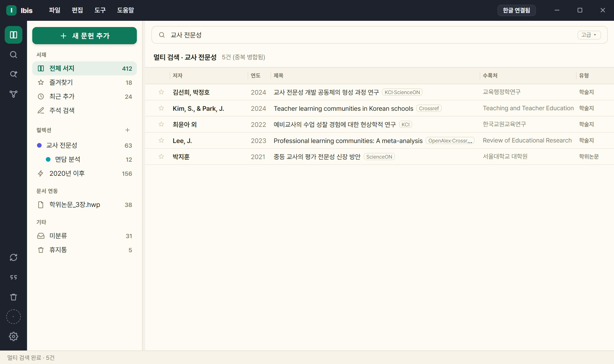

### 3.3 통합 검색(병렬 + 중복 병합)

- **'국내 통합'** — KCI · ScienceON · 국립중앙도서관을 **동시 질의**.
- **'해외 통합'** — OpenAlex · Crossref · ERIC · arXiv · S2 를 **동시 질의**.
- 병합 기준: **DOI 우선**, 없으면 정규화 제목+연도 → 출처를 누적 표시.
- 일부 소스가 실패(키 미설정·429)해도 나머지는 진행하고, 실패한 소스명이 결과 제목줄에 함께 보고됩니다.

### 3.4 DOI 즉시 서지화

- **방법 A** — 검색창에 DOI(또는 doi.org URL) 붙여넣기 → 소스 무관하게 1건 해석('내 서지' 소스만 예외).
- **방법 B** — `새 문헌 추가` 창의 **식별자로 채우기** 칸에 DOI 를 넣고 **[바로 저장]** → 해석 후 곧바로 내 서지에 보관.
  - 옆의 **[조회]** 는 대신 아래 양식을 채웁니다 — 확인·수정한 뒤 [추가]. 여러 건을 연달아 넣을 때는 [바로 저장]이 빠릅니다.
- doi.org content negotiation 사용 → 등록기관(Crossref·DataCite·mEDRA) 무관, 키 불필요.
- 국문 논문은 저장 시 DOI 로 KCI 를 조회해 국문 제목·학술지·한글 저자를 보강합니다.
- 형식 오류는 'DOI 형식이 아닙니다', 해석 실패는 'DOI 해석 실패'로 안내.

### 3.5 ISBN으로 단행본 추가

DOI 가 논문의 권위 키라면 단행본은 **ISBN** 입니다. 학술 DB(KCI·Crossref)는 단행본을 거의 담지 않으므로 도서관·서점 데이터로 조회합니다(논문의 'DOI로 채우기'에 대응하는 단행본용 기능).

- **추가** — `새 문헌 추가` 창의 **식별자로 채우기** 칸에 ISBN(하이픈 있어도 됨)을 넣고 **[바로 저장]**. 권위 조회 후 단행본 서지가 곧바로 내 서지에 보관됩니다.
- **폼에서 조회** — '새 문헌 직접 추가' 또는 서지 편집 폼의 ISBN 칸 옆 **'조회'** 버튼 → 제목·저자·발행처·출판지·연도·판차 등 **빈 칸만** 채웁니다(입력한 값은 보존).
- 조회 순서: **국립중앙도서관(서지정보유통) → OpenLibrary → Google Books.** 먼저 확인된 값을 우선하고 남은 빈 필드만 뒤 소스로 보강합니다.
- **국내서 조회에 설정할 것이 없습니다** — 국립중앙도서관은 앱 내장 키로 동작합니다. 해외서는 OpenLibrary 로 조회됩니다. Google Books 만 선택적으로 키를 넣을 수 있습니다([9.1](#91-api-키이메일-발급)).
- 찾지 못하면 'ISBN 서지를 찾지 못했습니다' 안내 → 직접 입력으로 추가([6.8](#68-서지-직접-추가)).

### 3.6 고급 검색(다중 조건)

검색창 옆 **'고급'**. 조건 줄을 ＋로 쌓아 올립니다.

- 한 줄 = `[그리고/또는][필드][포함/정확히 이 구][값]`.
- 한 묶음 **8줄**, 「또는」 묶음 **3개**까지. **「그리고」가 「또는」보다 먼저 묶입니다.**
- 비교는 `포함` / `정확히 이 구`. 일부 필드(DOI·ISBN·분류기호·자료구분·수록연도)는 `일치` 고정.
- 검색어에 낱말을 여럿(쉼표·공백) 쓰면 그 낱말을 **모두 든** 자료를 찾습니다.
- 빈 칸은 조건에서 제외, 적용된 조건은 결과 제목줄에 요약 표시.
- 고급검색을 열면 검색창의 글자가 **첫 조건 줄로 옮겨 갑니다**(닫으면 되돌립니다).

**필드 그룹 4개**

| 그룹 | 필드 |
|---|---|
| **공통** | 전체 · 제목 · 저자 · 발행처·학술지 · 키워드 |
| **KCI 전용** | DOI · 저자 소속기관 · 발행기관 |
| **국립중앙도서관 전용** | ISBN·ISSN · 분류기호 · 자료구분 · 수록연도 |
| **내 서지 전용** | 초록 · 첨부파일명 |

- 전용 필드를 고르면 **소스가 그쪽으로 따라갑니다.** 그 소스가 못 하는 조건은 조용히 무시하지 않고 이유를 안내줄에 적습니다.

**전역 한정자**(행이 아니라 질의 전체에 걸립니다)

- 소스 · **유형(공통)** · 정렬 · 발행년 범위.
- 유형 값: 전체 · 학술논문 · 학위논문 · 단행본 · 보고서 · 연속간행물 · 웹자료 · 비도서(소스마다 고를 수 있는 값이 다릅니다).
- `자료구분`(국립중앙도서관 전용)은 서버로 그대로 보내는 **자료 종별 13종**(일반도서·학위논문·정부간행물·공공간행물·아동도서·교과서·학습참고서·한장본·점자도서·장애인대체자료·비도서·연속간행물·온라인자료)이며 '유형(공통)' 과는 다릅니다.
- ⚠ **'단행본'·'보고서' 유형은 그 갈래의 일부만 찾습니다** — 국립중앙도서관 자료구분은 한 번에 하나만 보낼 수 있어 대표 코드 하나로 묻습니다(단행본=일반도서만, 보고서=정부간행물만). 앱이 이 사실을 결과줄에 매번 밝힙니다.
- ⚠ **초록 검색과 제외(NOT)는 일부러 넣지 않았습니다** — KCI 는 초록 조건을 받는 척하고 버리고, 국립중앙도서관 응답에는 초록 필드가 없기 때문입니다. 초록은 **'내 서지'** 에서만 고를 수 있습니다.

**다중 조건을 못 받는 소스** — ScienceON · OpenAlex · Crossref · ERIC · arXiv · S2 · 해외 통합.

검색이 도는 동안 페이지 버튼이 잠기고 `N쪽 불러오는 중…` 이 뜹니다.

### 3.7 페이지네이션

- 외부 소스는 페이지당 20건 → 하단 페이지 바(`‹ 1 2 3 … ›`).
- 페이지를 넘겨도 이전 결과는 인용 대상으로 유지.
- '다음 페이지 있음'은 '이번 페이지가 20건으로 참'으로 추정 → 마지막에 빈 결과가 한 번 나올 수 있음.
- 소스 한계: Crossref 오프셋 약 1만, S2 오프셋+개수 최대 1000.
- '내 서지' 검색은 전체를 한 번에 표시(페이지 바 없음).

### 3.8 내 서지 전문검색(FTS)

- 훑는 범위: 제목·저자·수록처·태그·키워드·**AI 요약(노트)**·초록·영문 병기 + **첨부 파일명**.
- 검색어 **3자 이상** → FTS5(트라이그램), **2자 이하** → 제목·수록처 LIKE 폴백.
- 고급 검색에서 필드를 좁히거나 파일명 검색이면 FTS 대신 지정 필드만 봅니다.

### 3.9 검색 결과에서 더 하는 일

**검색어 하이라이트 (2026.8.7)** — 결과가 수십 건이면 *왜 이 문헌이 걸렸는지*가 한눈에 안 보입니다. 이제 제목·저자·수록처에서 검색어에 해당하는 자리를 칠해 줍니다.

- 제목·저자·수록처 **어디에도 검색어가 없으면** 그 이유를 밝힙니다(`일치: 초록·주제어` 처럼) — 보이지 않는 칸에서 걸린 것입니다.
- **검색 결과 화면에서만** 칠합니다. 컬렉션이나 전체 서지 목록에서 지난 검색어가 칠해져 있으면 그것이 더 헷갈리기 때문입니다.

**참고문헌 계보 따라가기** — 어떤 논문이 무엇을 인용했는지 보고, 그중 필요한 것을 바로 담습니다.

- 문헌 상세에서 **[참고문헌 보기]** → 그 논문이 인용한 문헌 목록이 뜨고, 거기서 골라 내 서지에 담습니다.
- 출처는 **국내 논문이면 KCI, 해외 논문이면 Semantic Scholar** 입니다. 목록 머리에 `참고문헌 · N건 (출처)` 로 어디서 온 것인지 적습니다.
- KCI 논문은 **피인용 횟수**도 함께 보입니다(`피인용(KCI)`).

**부실한 서지 자동 보완** — 직접 입력하거나 인용문을 붙여 넣어 만든 서지는 칸이 비어 있기 쉽습니다. 저장할 때 검색 소스로 같은 문헌을 찾아 **빈 칸만** 채웁니다(적어 넣은 값은 건드리지 않습니다).

### 3.10 검색 결과 → 내 서지/컬렉션 보관

1. 결과에서 문헌 선택(다중 선택·드래그 가능).
2. 우클릭 '내 서지에 추가(미분류)' 또는 **컬렉션 트리로 드롭**(보관+배정 동시).
3. ★·원문 확보를 결과 행에서 실행하면 자동으로 먼저 보관됩니다.

- 저장 시 DOI 가 있고 국문 서지가 부실하면 KCI 로 보강하고 영문은 병기 필드로 보존.
- 인용 삽입 시에도 처음 보는 문헌은 자동 보관됩니다.

### 3.11 파일 가져오기

- 경로: `파일` › **가져오기** › '파일로 서지 가져오기 (RIS·BibTeX·CSL)…' → 파일 선택(복수 가능).
- 인식 **6형식**: RIS · BibTeX · CSL-JSON · EndNote(.enw) · RefWorks · Tab(.tsv/.csv).
- 기본 필터는 `.ris·.bib·.bibtex·.json` — **'모든 파일'** 로 바꾸면 나머지도 처리됩니다.
- CSL-JSON 을 무손실 정본으로 취급. 인용키가 비었거나 충돌하면 자동 재발급.

### 3.12 탐색기에서 파일 드래그로 추가

Windows 탐색기에서 파일을 끌어와 **목록(또는 사이드바 컬렉션·미분류) 위에 놓으면** 종류에 따라 자동으로 처리됩니다.

- **PDF** — 새 서지를 만들고 그 PDF 를 첨부합니다(제목은 파일명으로 임시 → 나중에 서지정보 채우기·편집).
- **RIS·BibTeX·XML 등 서지 파일** — 임포터로 서지를 가져옵니다([3.9](#311-파일-가져오기) 와 동일 처리).
- **컬렉션(뷰 또는 사이드바 항목)에 놓으면** 그 컬렉션으로 배정되고, **미분류·전체 서지에 놓으면** 미분류로 추가됩니다(휴지통은 무시).
- 드래그하는 동안 목록 위에 점선 드롭존과 안내('PDF=새 서지+첨부 · RIS/BibTeX/XML=서지 가져오기 · 컬렉션에 놓으면 그 컬렉션으로')가 나타납니다.
- 파일 **자체**를 추가하는 경로입니다 — 완성형 인용문 **텍스트**를 붙여 파싱하는 것은 아래 [3.11](#313-인용문-붙여넣기-파싱) 입니다.

### 3.13 인용문 붙여넣기 파싱

- '새 문헌 직접 추가' 창의 붙여넣기 상자에 텍스트를 붙이거나 파일을 끌어놓기.
- 구조화 포맷이면 구조 파싱, **완성형 인용문**이면 저자(연도)·제목·수록처·권(호)·쪽·URL·인출일을 분해.
- ⚠ 완성형 파싱은 **Crossref 서지 매칭을 하지 않습니다** — 무관한 논문이 채워지는 것을 막기 위해서입니다(본문에 DOI 가 있으면 그것만 해석).
- 인식 실패 시 값을 채우지 않고 빈 양식 유지 → 직접 입력.

### 3.14 내보내기

- `파일` › **내보내기** › '서지 전체 내보내기 (CSL-JSON)…' 또는 '(BibTeX)…'.
  - ⚠ 이 둘은 **서재 전체**입니다(보고 있는 컬렉션·선택과 무관). 컬렉션 하나만 내보내려면 사이드바에서 그 컬렉션을 우클릭하세요.
- **내보내기는 CSL-JSON·BibTeX 2종만** 지원합니다(가져오기의 EndNote·RefWorks·Tab 로는 내보낼 수 없음).

---

## 4. 본문 인용 삽입·재서식

### 4.1 인용 삽입 — 형태·쪽수

1. 문서에 연결([2절](#2-한글word-문서-연결)).
2. 문헌 선택 → 상세 패널에서 **형태**와 **'쪽'** 지정.
3. **'인용 삽입'** 클릭.
4. 삽입 즉시 문서 전체가 현재 스타일로 재서식되어 최종 표기 확정.

**인용 형태 5종**

| 형태 | 나오는 모양 | 쓰는 곳 |
|---|---|---|
| 괄호형 | `(홍길동, 2024)` | 기본 |
| 서술형 | `홍길동(2024)` | 문장 주어로 저자를 쓸 때 |
| 연도만 | `(2024)` | 앞에서 저자를 이미 밝혔을 때 |
| **서지에만 표시** | 본문에 아무것도 안 보임 | 본문에 인용하지 않고 참고문헌에만 올릴 때 |
| **표기 생략 — 쪽만** | `(23)` | 같은 문헌을 이어 인용하며 쪽만 바꿀 때 |

- 아직 내 서지에 없는 문헌은 자동 보관됩니다.
- **서술형은 복수 문헌도 됩니다** — `Apple (2013), Aranda (2021)` 처럼 나옵니다.
- **'연도만' 은 복수 문헌에 쓸 수 없습니다**(어느 문헌의 연도인지 알 수 없으므로 차단됩니다).
- 삽입 순간에는 임시로 저자-연도가 보이고, 곧바로 실행되는 전체 갱신에서 확정됩니다.

### 4.2 인용 편집 창 — 문서의 인용을 한눈에

레일의 **인용 아이콘**(❝)으로 엽니다. 문서의 인용 **전체가 문서에 나오는 순서대로** 보이는 항상 위 창입니다.

- **행을 클릭하면 한글이 그 인용 자리로 이동**합니다. 긴 원고에서 "이 인용이 어디 있더라" 를 찾아다니지 않아도 됩니다.
- **✎(더블클릭 또는 우클릭)** 으로 그 자리에서 고칩니다 — 표기 방식·쪽·접두/접미 문구·병렬 인용의 구성 문헌.
- 병렬 인용은 **구성 문헌을 하나씩 뺄 수 있습니다**(마지막 하나는 못 뺍니다 — 인용이 사라져 버립니다).
- **갱신 필요 배지** — 갱신하면 표기가 달라질 인용에 표시가 붙습니다. 무엇이 바뀔지 미리 보고 갱신할 수 있습니다.

### 4.3 병렬 인용 — 여러 문헌을 한 괄호로

- **방법 1** — 목록에서 여러 건 선택 → 우클릭 `⤵ 인용 삽입`.
- **방법 2** — 기존 인용 괄호 안에 커서를 두고 다른 문헌 인용 → `(a; b)` 로 합쳐지고 상태줄에 '병합' 보고.
- 커서가 인용 안이지만 앱이 그 기록을 모르면(문서에만 있는 인용 등) 중첩을 피해 **필드 밖에 인접 생성**합니다.

### 4.4 인접 인용 자동 병합

- 붙여 쓴 `(a)(b)` 를 전체 갱신 때 `(a; b)` 로 자동 병합.
- **한글에서만** 동작합니다(간격을 필드 위치로 계산) — Word 는 수행하지 않습니다.
- 간격이 0인 완전 인접만 대상.

### 4.5 전체 갱신 — '참고문헌 갱신'

EndNote 의 'Update Citations and Bibliography' 에 해당합니다.

1. 문서에 연결.
2. **사이드바 문서 우클릭 › '참고문헌 갱신'**(인용 삽입 때마다 내부적으로도 자동 실행).
3. 순서: 인접 병합 → 문서 순서대로 재서식 → 삭제된 인용 기록 정리 → 참고문헌 재구축.
4. 상태줄에 `갱신 완료 · 인용 N · 참고문헌 M건`.

- 인용·참고문헌은 항상 **내 서지(master) 기준**으로 렌더됩니다.
- 문서에만 있던 문헌은 내 서지로 자동 승격, 기록 없는 유령 인용은 orphan 으로 분리 보고.

### 4.6 직접 고친 인용 보호

한글에서 인용 표기를 **손으로 고친 뒤** 갱신하면, 덮어쓰기 전에 **묻습니다**.

- **'유지'** — 그 인용은 이후 갱신에서 제외됩니다(손으로 쓴 표기가 그대로 남습니다).
- **'정식 표기로 되돌리기'** — 스타일이 정한 표기로 다시 씁니다.
- 제외해 둔 인용은 **인용 편집 창의 [적용]** 으로 언제든 다시 갱신 대상에 넣을 수 있습니다.

> 종전에는 경고 없이 덮어써졌습니다. 특정 인용만 규정과 다르게 적어야 하는 경우(재인용 표기 등)에 씁니다.

### 4.7 원고 이어받기 — 평문 인용을 누름틀로 (2026.9.4)

Ibis 없이 쓰던 원고에도 쓸 수 있습니다. 본문의 `(홍길동, 2020)` 같은 **평문 인용을 찾아 관리 대상으로** 바꿉니다.

- 서재의 문헌과 짝지어진 것만 바꿉니다. **짝을 못 찾은 것은 건드리지 않고 표시만** 합니다.
- **본문 글자는 그대로**입니다 — 원문을 그대로 담아 누름틀로 감싸는 것이라 겉모습이 바뀌지 않습니다.
- 손으로 쓴 **참고문헌 목록은 손대지 않습니다.** 바꾼 인용으로 목록을 새로 세우려면 [참고문헌 생성·갱신]을 부르세요.
- 아래 [제출용 사본]과 짝입니다 — 평문으로 받아 관리하다가, 투고 직전에 다시 평문으로 냅니다.

### 4.8 제출용 사본 만들기 — 누름틀을 벗긴 평문 (2026.9.4)

국내 학회는 조판 부호가 없는 원고를 요구하는 일이 많습니다. 문서 연동 우클릭 › **[제출용 사본 만들기]**.

- **사본을 만들고 그 사본에서만** 인용 누름틀을 벗겨 평문으로 바꿉니다.
- 🚨 **원본은 그대로 남습니다** — 참고문헌 재생성도, 인용 양식 변경도 원본에서 계속됩니다. 사본은 내는 용도입니다.
- 문서에 심어 둔 숨은 기록은 사본에서 통째로 지웁니다.

### 4.9 연도 접미사 a/b

- 축약 저자표기와 연도가 같은 그룹을 **제목 사전순**으로 `2020a`·`2020b`.
- 본문 인용과 참고문헌에 일관 적용.
- 공저자 구성이 달라 이미 구별되면 붙이지 않음. 연도 미상은 `n.d.-a`.

### 4.10 문서별 인용 스타일

- 스타일은 **문서마다 따로 저장**됩니다.
- **연결 상태**에서 바꾸면 그 문서의 기존 인용·참고문헌이 즉시 재렌더.
- **미연결 상태**에서 바꾸면 앱 전체 기본만 변경.
- 지정: `⚙설정 › 인용 스타일`, 또는 사이드바 '문서 연동' 문서 우클릭 › '인용 스타일 변경'.
- 삭제된 스타일 id 가 문서에 남아 있으면 갱신 직전 `apa` 로 정규화해 오적용을 막습니다.

### 4.11 문서 데이터의 강건성(UUID·docstore)

- 문서마다 안 보이는 고유 ID 를 심습니다(한글=숨김 누름틀 이름, Word=문서 변수).
- 인용 데이터는 파일 경로가 아니라 **라이브러리의 `docstore/<uuid>.json`** 에 보관.
- 따라서 문서명 변경·폴더 이동·다른 PC 이어작업에 강건합니다.
- ⚠ 문서 파일만 전달하면 받는 쪽에는 그 기록이 없습니다 — 라이브러리 폴더(또는 해당 docstore json)를 함께 공유하세요.

---

## 5. 참고문헌·인용 스타일

### 5.1 내장 엔진 스타일 3종

| 스타일 | 특징 |
|---|---|
| **APA 7 (저자-연도)** | 국문 가나다 먼저 → 서양 알파벳 정렬 고정 |
| **Vancouver (번호형)** | 번호형 [n] 등장순. 자체 기본값은 저자 7인 이상이면 6인+et al., 무강조 |
| **번호형 [n] (APA 참고문헌)** | 본문 [n] + APA 형식 참고문헌 |

- 기본값 **APA**. 드롭다운에서 항상 맨 위 고정, 그 아래 사용자 저널 스타일이 가나다순.
- 이 3종은 저널 스타일의 '부모 엔진' 후보이기도 합니다.
- 구 이름 `apa7`·`author-year-ko` 는 `apa` 로 자동 매핑.

**내장 저널 스타일 2종** — `APA 6판`(부모 apa) · `교육사회학연구`(부모 apa).

**밴쿠버 부모도 파라미터가 먹습니다**(2026.8.1 에서 고쳤습니다).

- 저자 축약(`et al.` 기준·표시 인원) · 강조(제목/수록처) · DOI 표기 · 쪽 표기가 실제로 반영됩니다. 위 표의 밴쿠버 기본값은 **저널 스타일이 명시하지 않았을 때만** 쓰입니다.
- **쪽을 함께 인용하면 `[1](p23)`** 처럼 번호와 쪽을 구분합니다(종전 `[1, 23]` 은 다른 문헌 번호로 읽혔습니다). 학회가 쪽 표기를 지정했으면 그 표기를 씁니다.
- **학술지에 실리지 않는 자료**(단행본·보고서·연속간행물·비도서·웹자료·법령)는 수록처 자리에 **발행처**를, **학위논문은 수여기관**을 찍습니다.

**같은 저자·같은 해** 문헌의 `a`/`b` 는 **제목순**으로 붙고, 참고문헌 나열 순서도 그에 맞습니다(APA 7판 §9.47).

문헌 상세의 '스타일 미리보기' 는 문서에 들어가는 것과 **같은 경로**로 만들어집니다.

### 5.2 참고문헌 재구축 결과

- **항상 새 페이지에서 시작.**
- 첫 줄은 왼쪽 기준선, 둘째 줄부터 **APA 0.5in 내어쓰기**.
- 스타일이 지정한 강조를 **이탤릭·볼드·밑줄**로 반영(밑줄은 국문 단행본 관례용).
- 제목('참고문헌')은 **기본으로 넣지 않고** 스타일의 `bib_heading` 지정 시에만.

### 5.3 참고문헌은 '보이지 않는 표' 안에 있습니다 (2026.8.2)

참고문헌 목록은 **테두리 없는 한 칸짜리 표** 안에 들어갑니다. 화면과 인쇄에서는 일반 문단과 똑같이 보이고, 여러 쪽에 걸쳐 자연스럽게 이어집니다.

**왜 이렇게 바꿨나** — 종전에는 표시(마커)로 구간을 잡아 그 사이를 지우고 다시 썼습니다. 그 방식은 원고 본문까지 지울 수 있는 경로가 열려 있어서, 실제로 **참고문헌을 갱신하다 본문 인용이 지워지는 사고**가 있었습니다. 이제는 표 안의 내용만 갈아 끼우고 경계는 한글이 지키므로 **원고를 건드릴 방법 자체가 없습니다.**

**기존 문서를 열면 한 번만 이행됩니다.**

- 참고문헌 구간이 **앱이 쓴 그대로임이 확인되고** 문서가 저장돼 있으면, **`.hwp` 파일 백업을 만든 뒤** 자동으로 새 방식으로 옮깁니다.
- 확인되지 않으면(손으로 고친 흔적이 있는 등) **아무것도 지우지 않고** 어떻게 정리하면 되는지 안내합니다. 안내대로 글자만 지우시면 남은 표시는 앱이 정리합니다.
- 이행은 문서마다 한 번뿐입니다. 이후에는 그냥 갱신됩니다.

> ⚠ 이행 안내가 뜨면 **먼저 문서를 저장**하세요. 저장되지 않은 문서는 백업을 만들 수 없어 이행하지 않습니다.

### 5.4 저널 스타일 편집기

부모 엔진(apa/vancouver/numeric)에 파라미터를 얹어 학술지별 서식을 JSON 으로 저장합니다.

- 열기: `⚙설정 › 인용 스타일 › '저널 스타일 관리…'`.
- 절차: 기존 선택 또는 `＋ 새 저널 스타일` → 이름·부모·파라미터 편집(오른쪽 미리보기) → **저장** → 드롭다운에 즉시 반영.
- 편집 파라미터: 저자 축약 기준 · 최초 전원 표기 · 국문 저자 구분자(쉼표/ㆍ) · 영문 표기(& / and, et al., 이니셜) · 저자-연도 간격 · 쪽 구분(`,` / `:`) · 쪽 접두(p./pp.) · 제목 따옴표 · 강조 매트릭스 · DOI · 영문 병기.
- 내장 프리셋 **2종** — `APA 6판`(부모 APA) · **`교육사회학연구`(KJSE)**(부모 APA, 4인↑ 축약, 구분자 ㆍ, 무간격, 쪽 `1999: 34`, 논문제목 따옴표, 국문 볼드/영문 이탤릭, DOI 미표기).

저장·공유·주의:

- 위치: `<라이브러리 폴더>/journal_styles/<id>.json` — 클라우드 라이브러리면 PC 간 동기화, 파일 복사로 공유 가능.
- 내장 스타일은 삭제 불가. **같은 이름으로 저장하면 '사용자 판' 이 우선**하고, 사용자 판을 지우면 내장 복원.
- 부모가 **Vancouver 여도 파라미터가 반영됩니다**(2026.8.1) — 저자 축약·강조·DOI·쪽 표기가 먹습니다([5.1](#51-내장-엔진-스타일-3종)). 번호형[n]은 참고문헌에 반영됩니다.

### 5.5 언어×유형 강조 매트릭스

- 격자: 유형(학술지·신문·웹·단행본·학위논문·보고서·법령·챕터·학술대회) × 언어(국문/영문).
- 선택지: **기본 / 없음 / 기울임 / 볼드 / 밑줄**.
- '기본'(빈값) = 국문 볼드 · 영문 기울임.
- 한 언어만 지정하면 다른 언어도 동일 적용. 유형별 설정이 장르 폴백보다 우선.

### 5.6 언어별 논문 제목 따옴표

- 국문·영문을 각각 지정: 없음 / `" "` / `「 」` / `『 』`.
- '국문만 따옴표, 영문은 없음' 같은 규정 재현 가능.
- 단행본 유형은 따옴표 대신 강조 적용. 마침표는 따옴표 안쪽(`"제목."`).

### 5.7 둥근 따옴표 자동 정규화

- 곧은 따옴표를 문맥에 따라 여닫이 둥근 따옴표로 자동 교체(항상 적용, 설정 없음).
- 아포스트로피(it's, teachers')도 오른작은따옴표로 처리. 이미 둥근 것은 그대로.

### 5.8 DOI 표기 · 국문 영문 병기

- **DOI 표기** — 편집기 체크박스(기본 켜짐). DOI 가 없고 URL 이 있으면 URL 로 대체. 내장 '교육사회학연구' 는 미표기.
- **영문 병기** — 국문 문헌에 영문 정보가 있으면 항목 뒤에 영문 줄 추가. '병기 라벨'(예: `(Translated in English)`)을 지정하거나 비워 라벨 없이 출력. `title_en`·`authors_en` 등이 채워져 있어야 생성됩니다.

### 5.9 원고 세칙 AI 분석 → 스타일 초안

1. 편집기 상단 **'원고 세칙 AI 분석'**.
2. 입력: ① 규정 텍스트 ② 세칙 페이지 URL ③ 파일(PDF·DOCX·HWPX·TXT).
3. 초안이 폼에 채워지고 미리보기 반영 → 확인·수정 후 저장.

- `⚙설정` 의 AI 제공자가 준비돼 있어야 합니다([8절](#8-ai-기능)).
- 규정에 **명시된 항목만** 채우고 나머지는 기본값 유지. 언어별 따옴표·강조(밑줄 포함)까지 추출.
- 입력이 40자 미만이거나 추출 실패면 분석하지 않습니다. URL 은 약 20,000자까지.
- 레거시 `.hwp` 는 자동 추출이 어려우므로 한글에서 열어 붙여넣기(또는 `.hwpx`/PDF 저장) 권장.

### 5.10 실시간 미리보기

- 편집기 하단 '미리보기 (샘플 문헌)' — 파라미터를 바꿀 때마다 약 0.2초 뒤 갱신.
- 내장 샘플(국·영 혼합)으로 본문 인용 5형식 + 참고문헌 렌더.
- **한글 실행·문서 연결 불필요** — 순수 서식 계산이라 오프라인에서도 확인됩니다.

---

## 6. 서지 관리

### 6.1 마스터 라이브러리(전체 서지)

- 레일의 **'전체 서지'** 에서 전체 목록.
- **`library.json` 이 권위 데이터**(원자적 저장). SQLite `.db` 는 검색 색인용 로컬 프로젝션(재생성 가능·클라우드 밖).
- 문제 시 환경변수 `IBIS_BACKEND=file`(옛 이름 `HWPENDNOTE_BACKEND` 도 그대로 인정)로 파일 백엔드 복귀.
- 라이브러리 폴더를 클라우드에 두면 여러 PC 공유([9.6](#96-라이브러리-위치클라우드-폴더-동기화)).

### 6.2 컬렉션(계층·색·드래그앤드롭)

1. 사이드바 '컬렉션' 옆 **＋** → 이름 입력.
2. 문헌(다중 선택 가능)을 컬렉션으로 **드래그**하거나 우클릭 › '컬렉션에 추가'.
3. 컬렉션 우클릭 → 색 팔레트·이름 변경·하위 컬렉션 추가·삭제.
4. 빼기: 컬렉션 뷰에서 문헌 우클릭 › '이 컬렉션에서 제외'(Del) 또는 '미분류로'.

- 카운트는 **하위 포함 재귀 합계**.
- 상위 컬렉션을 삭제하면 하위는 상위로 재지정되고, **문헌 자체는 라이브러리에 남습니다.**

**흩어진 컬렉션 합치기 (2026.8.10)** — 같은 주제를 여러 번 만들어 나뉘어 있을 때 하나로 모읍니다.

1. 사이드바에서 **Ctrl+클릭**(범위는 Shift+클릭)으로 컬렉션을 둘 이상 고릅니다.
2. 우클릭 › **[컬렉션 합치기]** → 어느 것을 남길지 고릅니다.

- **문헌은 지워지지 않습니다** — 컬렉션 구성만 바뀌고, 양쪽에 있던 문헌은 한 번만 남습니다.
- 없어지는 컬렉션의 **하위·스마트 컬렉션은 남는 컬렉션 밑으로** 갑니다(삭제는 상위로 올리는 것과 다릅니다).
- ⚠ **클라우드로 공유 중인 컬렉션은 없어지는 쪽이 될 수 없습니다** — 서재에서 사라지면 동료와의 공유가 끊기기 때문입니다.

### 6.3 스마트 컬렉션(조건 저장)

1. 사이드바 '스마트 컬렉션' 옆 **＋**.
2. 조건 입력: 검색어(제목·수록처·태그 포함) · 저자 · 태그(정확히 일치) · 연도 범위 · 유형. 빈 칸은 무시.
3. '만들기' → 조건에 맞는 문헌이 자동으로 묶임.

- 멤버십은 열 때마다 계산되므로 문헌을 추가·수정하면 자동 반영됩니다.
- 유형 드롭다운은 학술지·단행본·챕터·학위논문 4종(그 외는 검색어·태그로).

### 6.4 태그

- 상세 패널 태그칸에 **쉼표/세미콜론 구분**으로 입력(최대 20개).
- **AI 요약 실행 시 태그 자동 추가**(직전 AI 태그만 교체, 수동 입력은 보존).
- 웹판에는 별도 태그 목록이 없습니다 — **태그를 훑는 주 인터페이스는 태그 그래프 뷰**.

### 6.5 태그 그래프 뷰

태그=노드, 같은 문헌에 함께 달린 태그=연결선(자체 포스 레이아웃, 외부 라이브러리 없음). 노드 크기는 문헌 수에 비례.

1. 레일의 **그래프 아이콘**.
2. 상단 **스코프**: 전체 서지 / 컬렉션 / ⚡스마트 / 📄문서.
3. **'조절'** 펼치기: 폰트·중력·간격·크기·태그수(최대 60, 기본 40)·연결선(약한 공출현 숨김).
4. 조작:
   - 노드 **클릭** → 그 태그의 문헌이 중앙 목록에(스코프 유지)
   - 노드 **드래그** 재배치 · 빈 곳 드래그 팬 · 휠 줌
   - **호버** → 이웃만 밝게
   - 빈 곳 **더블클릭** → 별도 창
   - 노드 **우클릭** → 이름 변경·병합 / 삭제

- 태그가 없으면 그래프가 빕니다(AI 요약이 태그를 자동 생성).
- 스코프가 좁으면 비어 보일 수 있으니 '전체 서지' 로 확인.

### 6.6 태그 이름 변경·병합 / AI 태그 정리

- **개별** — 그래프에서 노드 우클릭 › '이름 변경·병합'. 대상 이름이 이미 있으면 자동 병합. '태그 삭제'로 전체 제거.
- **일괄(AI)** — `도구` › 'AI 태그 정리…' → 음차·번역·띄어쓰기 차이의 병합안 제안 → **적용할 묶음만 선택**해 반영(수십 초 소요, AI 설정 필요).
- 태그 정책: 표기 변형은 원어로 병합, 번역쌍은 `LLM(거대언어모델)` 식 병기 한 태그로 통합.

### 6.7 즐겨찾기 · 최근 추가 · 미분류 · 휴지통

- **★즐겨찾기** — 문헌 우클릭 › '즐겨찾기 토글'.
- **최근 추가** — **최근 30일**에 담은 문헌(2026.9.4 부터 기간 기준). 종전에는 상위 50건이라 하루에 100건을 넣으면 절반이 안 보였습니다. 같은 날 안에서도 시각순으로 놓입니다.
- **미분류** — 어느 컬렉션에도 속하지 않은 문헌.
- **휴지통** — 삭제는 곧바로 지우지 않는 soft delete.
  - 이동: 우클릭 › '휴지통으로 이동'(확인 팝업) 또는 레일 휴지통 아이콘으로 드래그.
  - 복원: 휴지통 뷰에서 우클릭 › '복원'(컬렉션 소속까지 복구).
  - '영구 삭제' 는 되돌릴 수 없습니다. 같은 인용키가 이미 있으면 복원이 실패합니다.

### 6.8 서지 직접 추가

검색으로 안 잡히는 자료(국역서·단행본·정부문서·법령 등).

1. 사이드바 **[＋ 새 문헌 추가] › '새 문헌 추가…'**(또는 `파일` › '새 문헌 추가…', `Ctrl+N`).
2. **붙여넣기** — 인용문이나 DB 내보내기 파일을 넣고 '파싱하여 추가'(본문 DOI 는 Crossref/KCI 로 확인).
3. **유형 선택** — 학술지·단행본·챕터·학술대회·학위논문·보고서·법령·조례·웹·신문기사(유형별 상세칸이 바뀜).
4. 확인·수정 후 '추가' → 인용키 자동 생성.

- **폼이 유형에 맞게 바뀝니다 (2026.8.3)** — 유형을 고르면 그 유형이 실제로 쓰는 칸만 남습니다. 학위논문이면 수여기관·학위, 단행본 수록 장이면 수록서·편저자·판차·권, 법령이면 발령주체·호수·시행일 하는 식입니다. 필요 없는 칸을 지나치지 않아도 되고, **적어 넣은 값이 저장 때 조용히 버려지는 일도 없어졌습니다**.
- **식별자로 채우기** — DOI 또는 ISBN 을 넣으면 조회해서 **빈 칸만** 채웁니다(입력한 값은 보존).
- **주소 한 줄로 온라인 자료·신문기사 (2026.9.4)** — 같은 칸에 기사·웹 주소를 넣으면 제목·매체명·저자·게시일을 채우고 검색일을 오늘로 넣습니다. 페이지가 표준 정보를 주면 그것을 쓰고, 없으면 본문을 Ibis AI 가 읽어 뽑습니다.
- **단행본은 더 채워집니다 (2026.9.1)** — 카카오 책·알라딘을 함께 보아 **책소개·역자(저자와 분리)·ISBN·분류·쪽수**를 가져옵니다. 이미 서재에 있는 단행본에도 일괄로 적용할 수 있습니다.
- **여러 권으로 된 책·연속간행물 (2026.9.3)** — 단행본이 여러 권짜리면 **'권'** 칸이, 연속간행물이면 **'권·호'** 칸이 함께 나옵니다. 종전에는 넣을 자리가 없어 제목에 붙여 쓰거나 학술지 칸을 빌려 썼고, 그러면 참고문헌에 어색하게 찍혔습니다.
- **판본이 여럿이면 직접 고릅니다 (2026.8.4)** — 같은 책의 초판·개정판·다른 출판사본이 함께 잡히면 앱이 임의로 하나를 고르지 않고 **후보를 보여 줍니다**. 판차·출판사·연도를 보고 내가 든 책을 고르면 그 값으로 채웁니다.
- **초록** — 넣으면 전문검색·AI 요약에 활용(참고문헌에는 출력 안 함).
- **발행일** — 월·일까지 넣으면(예: 2023. 07. 22) 신문기사 참고문헌에 출력.
- **법령·조례** — 제정기관=저자칸, 발령주체=수록처칸, 호수=호칸(제N호).
- 완성형 서지(RIS 등)는 그대로 채우고 Crossref 매칭을 하지 않습니다. 제목·저자가 모두 비면 추가되지 않습니다.

### 6.9 중복 정리 · 첨부 관리 · 정렬

- **중복 정리** — `도구` › '중복 문헌 정리'. 몇 건을 합치는지 먼저 확인창으로 알리고 승인을 받습니다(되돌리기 어렵기 때문). 무엇을 합칠지 눈으로 보려면 사이드바 **중복 점검** 을 여세요. DOI 또는 정규화 제목+연도가 같은 문헌을 **가장 충실한 1건**에 병합(빈 필드 보강·첨부/키워드 합침·컬렉션 이관·★·이른 추가일 승계).
- **첨부(PDF)** — 우클릭 › '원문 확보'로 자동 첨부([7절](#7-원문-확보pdf-뷰어)). 서지 기반 자동 개명('첫저자 - 연도 - 제목'), 오첨부는 '다른 문헌으로 이동'.
- **담는 순간 이름이 정리됩니다 (2026.9.4)** — PDF 를 끌어다 놓거나 원문 확보로 붙일 때 곧바로 '첫저자 - 연도 - 제목' 으로 바뀝니다. 아래 일괄 정리는 예전에 쌓인 것을 치울 때 씁니다.
- **첨부 이름 일괄 정리** — `도구` › '첨부 이름 일괄 정리'(이전 이름: 첨부 자동 이름 정리). 라이브러리 전체 첨부를 서지 기반 파일명으로 한 번에 정리하고 결과(정리·유지·실패)를 브리핑합니다.
- **연결 안 된 PDF** — 첨부 '연결 해제' 는 파일을 지우지 않아 폴더에 남습니다. 사이드바 *기타* › '연결 안 된 PDF' 에서 목록·파일명 필터·크기 정렬로 확인하고 **문헌에 연결 / 새 서지로 만들기 / 선택 삭제**(주석 사이드카·빈 폴더까지 정리).
- **정렬** — 컬럼 헤더 클릭 → 정렬, 다시 클릭 → 오름/내림(▲▼). 연도는 기본 내림차순, 텍스트는 오름차순. 헤더 경계 드래그로 폭 조절, 더블클릭으로 기본 폭 복원.

---

### 6.10 컬렉션 공유

읽을 거리 묶음을 동료와 나눕니다. **두 방식이 병행**합니다 — 어느 하나가 다른 하나를 대신하지 않습니다.

| | 파일로 건네기 | 클라우드 공유 (베타) |
|---|---|---|
| 성격 | **한 번 건네고 끝** | **계속 맞춰 감** |
| 필요한 것 | 없음 | 구글 로그인 |
| 오프라인 | 됨 | 안 됨 |
| 받는 쪽이 고친 것 | 안 돌아옴 | 돌아옴 |

#### 파일로 건네기 (`.ibiscol`)

1. 컬렉션 우클릭 › **[공유 파일로 내보내기 (.ibiscol)…]** — 하위 컬렉션까지 통째로 담깁니다.
2. 받는 쪽은 컬렉션 영역 우클릭 › **[공유 컬렉션 가져오기 (.ibiscol)…]** 로 내 서재에 합칩니다.

- 메일·메신저·USB 어느 것으로 건네도 됩니다. 서버를 거치지 않습니다.
- 같은 문헌이 이미 있으면 중복으로 쌓지 않고 합칩니다(DOI 우선, 없으면 제목+연도).

#### 클라우드 공유 (베타)

1. `⚙설정 › 클라우드` 에서 **[구글로 로그인]**. 로그인 창의 **[개인정보 처리방침 보기]** 로 무엇을 받아 가는지 먼저 볼 수 있습니다 — **받는 개인정보는 이메일 주소 1개**(참가자 식별·초대용)뿐이고 별도 가입은 없습니다.
2. 컬렉션 우클릭 › **[클라우드로 공유…]**.
3. 우클릭 › **[초대…]** 에 상대 구글 이메일을 적으면 **그 사람 Ibis 가 켜질 때** 초대가 뜹니다. 링크·문안 복사와 메일 앱으로 보내기도 함께 있습니다.

- **손대지 않아도 맞춰집니다** — 서지를 고치면 1분 안에 올라가고, 다른 창을 보다 Ibis 로 돌아올 때 한 번, 그리고 10분마다 전량을 맞춥니다. 사이드바 공유 배지가 동기화 중이면 돕니다.
- 우클릭 **[참가자·초대 관리…]** 로 누가 들어와 있는지 보고 잘못 나간 초대 링크를 끊습니다. **같은 창에서 바로 초대장도 만듭니다**(2026.9.3 — 종전에는 다른 메뉴로 나가야 했습니다). **[활동 기록…]** 은 누가 언제 무엇을 바꿨는지 보여 줍니다.
- **그만두기** — 우클릭 **[클라우드 공유 해제…]**. 소유자는 *서버에서 없애기* 와 *이 PC 연결만 끊기* 중에 고르고, 참가자는 **[공유에서 나가기]** 입니다.
- 상태줄에 `☁ 사용량 / 5MB`(베타 할당)와 **[동기화]** 버튼이 보입니다. 상한에 닿으면 올리기가 거절되고 그 사실을 알립니다.

#### 내 서재 동기화 (여러 PC · 베타)

위의 컬렉션 공유가 *동료와* 나누는 것이라면, 이것은 **같은 구글 계정으로 로그인한 내 다른 PC** 와 **서재 전체**를 맞춥니다. `⚙설정 › 클라우드` › **[내 서재 동기화 (여러 PC)]**.

- 문헌·컬렉션 구성은 물론 **개인 메모·즐겨찾기·초록까지** 갑니다 — 받는 쪽이 남이 아니라 나 자신이므로 가릴 이유가 없습니다. **PDF 원문 파일은 여기서도 올라가지 않습니다.**
- **다른 PC 에서 이미 켰다면 그것을 먼저 받아 합칩니다** — 어느 쪽을 먼저 켜야 하는지 고민할 필요가 없습니다.
- **한쪽에서 지운 것은 다른 PC 에서도 정리됩니다** — 문헌은 휴지통으로, 컬렉션은 없어지되 **그 안에 있던 문헌은 서재에 남습니다**. 무엇이 없어졌는지는 동기화 결과에 알립니다.
- **남과 나눌 수 없습니다** — 서재 동기화는 초대가 서버에서 거절됩니다. 동료와 나누는 것은 위의 컬렉션 공유이고, **둘을 함께 켜 두어도 됩니다.**
- **PDF 파일까지 여러 PC 에서 쓰려면** 지금처럼 라이브러리 폴더를 OneDrive 같은 클라우드 폴더에 두세요 — 서재 동기화는 그것을 대체하지 않고, 폴더 동기화가 약한 부분(같은 서지를 양쪽에서 고쳤을 때 생기는 충돌본)을 서버가 칸 단위로 정리합니다. **둘을 함께 쓰는 것이 권장 구성입니다.**
- **끄기** — 기본은 이 PC 연결만 끊기입니다. 서버의 사본은 남아 다시 켜면 이어지고, 원하면 서버 사본까지 함께 지울 수 있습니다.
- ⚠ 베타 용량은 **1인 5MB**(서지·주석 기준 — 약 2,000건). ⚠ 다른 PC 에서 처음 켤 때 **합치기 미리보기는 아직 없습니다**(합치기만 하고 지우지는 않으며, 결과를 '새 문헌 N건'으로 알립니다).

#### 무엇이 나가고, 무엇이 안 나가나 (두 방식 공통)

| 나가는 것 | 나가지 않는 것 |
|---|---|
| 서지 · 컬렉션 구성 | **PDF 원문 파일** |
| 하이라이트·메모(파일이 아니라 **위치와 문장**으로) | 개인 메모 · 즐겨찾기 |
| Ibis 가 만든 AI 요약 섹션 | 그 밖의 노트 |

- ⚠ 이 표는 **남에게 건네는 두 방식**(파일 공유·컬렉션 공유)의 규칙입니다. 바로 위의 **내 서재 동기화**는 받는 쪽이 나 자신뿐이라 개인 메모·즐겨찾기·초록도 함께 올라갑니다(PDF 원문은 거기서도 제외).

- 하이라이트가 **문장**으로 가기 때문에, 받는 쪽이 그 원문을 스스로 확보해 열면 **판본이 달라 쪽수가 어긋나도** 문장으로 다시 찾아 붙습니다.
- PDF 를 보내지 않는 것은 저작권 때문입니다 — 받는 쪽이 자기 도서관 계정으로 확보하면 됩니다([7절](#7-원문-확보pdf-뷰어)).
- 클라우드는 **초록도 올리지 않습니다**(용량).

#### ⚠ 베타 한계 — 미리 아셔야 할 두 가지

1. **서지 교정은 칸 단위로 오갑니다**(2026.8.8 부터). 지난 동기화와 견주어 **내가 손대지 않은 칸**을 동료가 고쳤으면 받아 오고 **내가 고친 칸**은 지킵니다. 서로 다른 칸을 고친 것은 둘 다 삽니다. **같은 칸을 둘이 다르게 고친 경우에만** 나중 것으로 맞추고 **무엇이 덮였는지 알립니다** — 다만 시각 비교가 문헌 단위라 **같은 날 안에서의 앞뒤는 못 가립니다**. 중요한 교정은 서로 알려 주세요.
2. **컬렉션의 이름·색·정렬 순서를 바꾼 것은 전파되지 않습니다.** 참가자마다 다른 이름으로 굳는 것을 막기 위해 일부러 뺐습니다(넣으면 서로 되밀기를 반복합니다). 문헌을 넣고 빼는 것은 정상으로 오갑니다.

## 7. 원문 확보·PDF 뷰어

> **준법 정책** — 구독 학술 DB(DBpia·KISS·교보스콜라·ScienceDirect·Springer 등)에 **일절 자동 접속하지 않습니다.** 자동 로그인·클릭·크롤링·다운로드를 하지 않고, 도서관 교외접속으로 **브라우저에 열어주기만** 합니다. 무료 공개(OA)·무료 기관 리포지터리만 자동 확보합니다.

### 7.1 OA 원문 자동 확보

1. 문헌 선택 → 상세의 **'원문 확보'**(다운로드 아이콘). 검색 결과 행에서 누르면 먼저 보관됩니다.
2. 시도 순서: **arXiv → Unpaywall → Semantic Scholar → 랜딩의 `citation_pdf_url` · KCI 무료원문.**
3. DOI 가 없으면 ScienceON→Crossref 로 DOI 를 보강해 재시도.
4. 확보되면 첨부되고 상태줄에 출처 표시.

- ⚙설정의 **'이메일(OA·polite)'** 을 넣어야 Unpaywall 이 켜집니다(미설정 시 그 단계는 호출 없이 건너뜀).
- 검증: `%PDF` 매직 · 10KB 초과 · 100MB 미만 → HTML 오류·랜딩 페이지를 걸러냅니다.
- 이미 PDF 가 첨부된 문헌은 건너뜁니다.

### 7.2 일괄 확보 + 브리핑

- **방법 A** — `도구` › '원문 일괄 확보'(PDF 미보유 전체 — 이전 이름: PDF 일괄 확보).
- **방법 B** — 목록 다중 선택 → 우클릭 › '원문 확보 (N건)'.
- 진행률 `(i/N)` 과 **예상 남은 시간** 표시, 완료 후 `확보 N · 구독DB N · 미확보 N` 브리핑.
- 무료 건은 자동 다운로드, 구독DB 건은 '열기' 로 브라우저.

### 7.3 구독 DB 감지 → 도서관 교외접속 경유

1. `⚙설정` 의 **'도서관 경유 URL'** — **목록에서 소속 기관을 고릅니다**(2026.9.2 부터 34개 기관). 목록에 없으면 종전처럼 주소를 직접 넣습니다(예: `https://proxy.○○.ac.kr/_Lib_Proxy_Url/`). 옆의 **[확인]** 으로 그 주소가 실제로 응답하는지 눌러 볼 수 있습니다.
2. 구독 DB 로 판정되면 결과 팝업에 **벤더명 + '브라우저로 원문 페이지 열기'**.
3. 기본 브라우저로 프록시 경유 페이지가 열립니다.
4. **로그인 후 직접 다운로드** → 폴더 감시로 자동 첨부([7.6](#76-다운로드-폴더-감시--자동-첨부)).

- DOI 는 최종 랜딩까지 해석한 뒤 프록시로 감쌉니다. 이미 프록시된 주소는 이중 프록시하지 않습니다.
- ⚠ **프록시는 미로그인 시 접근을 튕깁니다** — 먼저 도서관 홈페이지 로그인으로 세션을 만드세요([9.4](#94-도서관-교외접속프록시-경유-설정)).

### 7.4 다중 제공처(RISS) · 학위논문 자동 확보

- **다중 제공처** — 한 논문이 여러 구독 DB 에 있을 때, 도서관 경유 URL 이 설정돼 있으면 RISS 를 숨김창으로 렌더해 제공처를 수초간 열거합니다. 2곳 이상이면 '○○로 열기' 버튼 → 기관에서 열리는 곳 선택(다운로드하면 자동 첨부). 무료 공개 메타인 RISS 만 읽습니다.
- **학위논문** — 무료 기관 리포지터리 경로(**RISS → dCollection**)를 자동으로 따라가 PDF 를 받아 첨부합니다(프록시·로그인 불필요). 성공 시 '원문 자동 첨부: 학위논문(dCollection)'. 이용 동의·DRM 으로 막히면 브라우저로 상세를 열고, 사용자가 받으면 폴더 감시로 첨부.

### 7.5 원문 URL 직접 붙여넣기

- 원문 확보 실패 팝업 › **'원문 URL로 확보…'**.
- 벤더 원문 페이지 URL 또는 도서관 검색의 프록시 주소를 붙여넣기 → 브라우저로 열림 → 받으면 자동 첨부.
- 프록시 주소를 그대로 넣으면 이중 프록시 없이 그대로 엽니다.
- 코리아스콜라 등 KCI·RISS 에 안 잡히는 DB 에 유용합니다.

### 7.6 다운로드 폴더 감시 → 자동 첨부

- 원문 페이지를 열면 앱이 단일 감시 스레드를 켭니다.
- 여러 건 병행 시 **파일명↔제목(국·영) 대조로 유일 후보에만** 자동 첨부.
- 애매하면 **'이 PDF 는 어느 논문?'** 팝업(추천 후보 상단)에서 직접 지정.
- 감시 대상: OS 다운로드 폴더 + 보조 폴더(`lib_downloads`). 대기 문헌이 없으면 무관한 다운로드는 건드리지 않고, 유휴 90초 후 종료.

### 7.7 인앱 PDF 뷰어와 주석

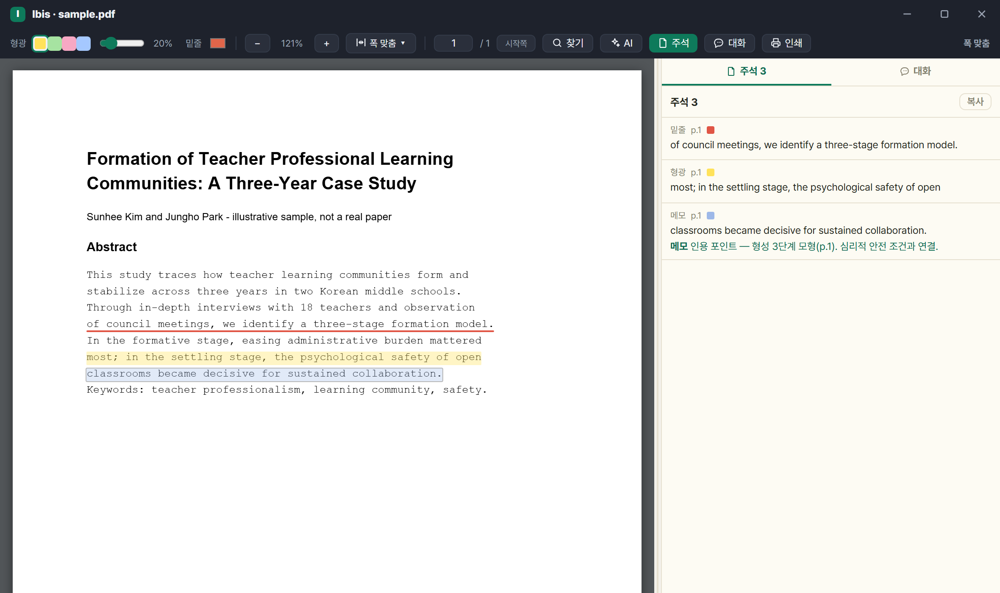

- 상세 패널의 첨부 클릭 → **앱 안 PDF 뷰어**(별도 창).
- 기능: 확대·축소 · 폭/쪽 맞춤 · 한쪽/두쪽 보기 · 페이지 이동 · 인쇄(주석 포함).
- **본문 찾기 `Ctrl+F`** — 열려 있는 PDF 전체에서 찾습니다. 아직 화면에 그려지지 않은 쪽도 포함하고, **띄어쓰기·줄바꿈·대소문자를 무시**해 PDF 특유의 줄 끊김에 걸리지 않습니다. `Enter`·`Shift+Enter` 로 다음·이전, `Esc` 로 닫습니다.
- **주석**: 형광펜(색·투명도)·밑줄·메모. 드래그 후 우클릭 또는 `H`·`U`·`N`. 목록 버튼으로 문서의 주석 모아보기.
- **수백 쪽 PDF(학위논문 등)** — 보이는 쪽만 먼저 그리는 지연 렌더로 큰 파일도 빠르게 엽니다. 인쇄 쪽번호 자동 인식이 틀리면 뷰어 툴바의 **'시작쪽'** 칸에 첫 페이지의 인쇄 쪽번호를 넣어(Enter) 쪽번호를 재계산·보정합니다.
- **PDF 판본이 바뀌면** — 주석을 단 뒤 첨부 PDF 가 교체·변경되면 좌표가 어긋날 수 있어 주석 목록·상태줄에 **'⚠ PDF 가 바뀌어 위치가 어긋날 수 있음'** 이 표시됩니다. 주석에는 **PDF 판본 지문(sha256)과 선택 앞뒤 문맥 32자**를 함께 저장해 판본 변경을 알아채고 재정렬을 시도합니다.
- 저장: PDF 옆 `<파일명>.annots.json` 사이드카 → 라이브러리 동기화를 따라감.
- 사이드바 **'주석 검색'** 으로 라이브러리 전체 주석 검색 — 보관한 AI 문답([7.8](#78-pdf-창-대화-탭))도 함께 나오고 결과줄에 `주석 N · AI 대화 M` 으로 갈라 셉니다. **주석 개수 배지와 인쇄 모음은 주석만** 세므로 보관 답변으로 부풀지 않습니다.
- PDF 가 아닌 첨부는 OS 기본 앱으로 열립니다.

### 7.8 PDF 창 '대화' 탭

**지금 읽는 논문을 근거로** 묻고 답합니다. 이어서 되물을 수 있습니다.

논문 밖의 것 — 용어의 뜻, 그 방법의 통상적인 한계, 배경 — 도 물어볼 수 있고, **답이 어디서 왔는지 표시가 갈립니다**(2026.8.11).

- 뷰어 툴바의 **[주석]·[대화]** 버튼 → 오른쪽 도크를 **탭 2개**(`주석 N` · `대화 ★N`)로 나눠 씁니다. 손잡이로 폭 조절(기본 400px).
- 입력: **`Ctrl+Enter` 전송**, Enter 는 줄바꿈. 버튼은 `새 대화` · `중지` · `보내기`.
- 답변이 **쓰이는 대로 흘러나옵니다**(스트리밍 — Claude CLI·Antigravity CLI). [중지] 하면 받은 데까지 남습니다.
- **표시 세 가지 — 무엇을 믿어도 되는지 한눈에 보입니다.**

  | 표시 | 뜻 |
  |---|---|
  | **(p.9)** 굵고 누를 수 있음 | 앱이 **원문에서 실제로 찾아 확인한** 근거. 누르면 그 자리로 갑니다 |
  | (일반 지식) | 논문 밖에서 온 답. 쪽을 붙이지 않습니다 |
  | (쪽 미확인) | 따옴표 친 인용인데 원문에서 못 찾았습니다 — **그대로 옮겨 적기 전에 눈으로 확인하세요** |

  쪽 번호는 모델이 적은 것을 믿지 않고 **앱이 원문에서 되찾아 확정합니다.** 쪽을 걸친 인용(`p.3-4`)도 확인해 링크합니다.
- **대화는 그 창에서만 유지되고 저장되지 않습니다** — 남길 답만 **[보관]** 하세요. 보관분은 상단에 접혀 쌓이고, `새 대화` 는 이력만 버립니다.
- 본문이 길어 앞부분만 실렸으면 **몇 %만 읽었는지**를 답변 옆에 적습니다.
- 대화·주석 패널의 글자는 **고르고 복사할 수 있습니다.**
- **지난 대화 (2026.9.4)** — 그 PDF 에서 주고받은 문답이 남습니다. 창을 닫았다 다시 열어도 이어서 물을 수 있고, 목록에서 옛 대화를 골라 되돌아갑니다.
- AI 제공자 설정이 필요합니다([8.4](#84-ai-제공자모델폴백)).

---

## 8. AI 기능

> AI 는 **둘 중 하나**로 돕니다 — 내 구독 CLI·API 키를 쓰거나, 앱이 주는 **Ibis AI 크레딧**을 씁니다([8.4](#84-ai-제공자모델폴백)). 어느 쪽도 설정하지 않으면 AI 기능만 비활성이고 나머지는 그대로 됩니다.

### 8.1 AI 문헌 요약

첨부 PDF 본문을 읽어 한국어 요약(연구질문·방법·핵심결과·시사점/한계) + 태그 + 키워드를 생성합니다.

1. 문헌에 **PDF 가 첨부돼 있어야** 합니다(없으면 먼저 원문 확보).
2. 상세의 **AI 아이콘** → 확인 팝업에서 '요약 실행'.
3. 여러 건은 선택 후 우클릭 › 'AI 요약 (N건)' → 순차 실행 + 건별 브리핑.
4. 저장 위치: 노트의 **`## AI 요약` 섹션** · 문헌 태그 · 서지 키워드.

- **스캔본도 읽습니다 (2026.9.2)** — 글자가 없는 PDF 는 Windows 내장 글자 인식으로 본문을 뽑아 넘깁니다. 종전에는 건너뛰고 OCR PDF 로 바꾸라고 안내만 했습니다.
- **재요약 시** 'AI 요약' 섹션과 직전 AI 태그·키워드만 교체하고 **사용자 메모·수동 태그는 보존**.
- 표기 분화를 막으려 내 서지 상위 태그(최대 40개)를 프롬프트에 함께 넘겨 기존 표기를 재사용합니다.
- 태그는 각 12자 이내·최소 4개, 주제·방법·대상 위주(일반어·메타어 배제).

**여러 건을 한꺼번에 — 동시 실행 (2026.8.7)**

- 여러 편을 골라 일괄 요약을 걸면 종전에는 한 건씩 차례로 돌았습니다. 이제 `⚙설정 › AI` 의 **[동시 실행]**(1~5, 기본 3)만큼 나란히 돕니다.
- ⚠ **올린다고 무조건 빨라지지 않습니다.** 구독(CLI)은 **사용량 한도에 그만큼 빨리 닿고**, API 키는 **분당 한도**에 걸립니다. 한도로 보이는 실패가 두 건 이상이면 결과 브리핑이 동시 실행을 낮춰 보라고 알려 줍니다.
- ⚠ 이 설정은 **AI 호출에만** 걸립니다 — 학술DB 검색·원문 확보의 동시 요청 수는 따라 올라가지 않습니다.

### 8.2 서지정보 AI 채우기

**DOI 가 있으면 권위 소스(Crossref·KCI)를 먼저** 조회하고, 빈 항목이 남을 때만 PDF 표지를 AI 로 분석합니다.

1. 상세의 **마법봉 아이콘**. 여러 건은 우클릭 › '서지정보 채우기 (N건)'(동시 실행: CLI 2건·API 3건).
2. 진행: 'DOI 우선 확인 → 필요 시 PDF 분석'.
3. 완료 후 경로 안내: 'DOI 확인(KCI·Crossref)' · 'AI 생략' · 'AI 실패(DOI만 반영)'.

- 유형별로 채웁니다 — 학위논문=수여기관·학위 / 단행본·챕터·학술대회=출판사·출판지 / 학술지=학술지명·권·호·쪽.
- 영문 제목·학술지·저자는 병기 필드로.
- **DOI 만 있고 PDF 가 없어도** Crossref 로 채워집니다. 둘 다 없으면 '원문 확보 먼저' 안내.
- **다른 판을 잡으면 알립니다 (2026.9.2)** — 단행본에서 조회 결과의 출판연도·판이 가지고 있는 서지와 어긋나면 덮어쓰기 전에 경고합니다. 같은 책의 다른 판은 쪽수가 달라 인용 쪽이 어긋나기 때문입니다.
- 기존 값은 덮어쓰지 않고 **빈 곳만 보완**(권위 DOI 값 우선).

### 8.3 AI 태그 정리

1. `도구` › 'AI 태그 정리…'(태그 2개 이상 필요).
2. 확인 팝업에서 '제안 받기'.
3. 제안이 **'표기/병기/삭제' 배지** + 대상 건수와 함께 표시 → 적용할 묶음만 체크 → '선택 병합 적용'.

- **검토 범위**를 고를 수 있습니다 — 몇 개의 태그까지 들여다볼지 지정합니다. 넓히면 더 많이 찾지만 그만큼 오래 걸리고 AI 사용량도 늡니다.
- AI 는 제안만 하고 **반영은 사용자가 고른 것만**.

### 8.4 AI 제공자·모델·폴백

`⚙설정 › AI 탭`. **1차 제공자**와 **폴백 제공자**를 각각 제공자·모델·추론 강도로 지정합니다.

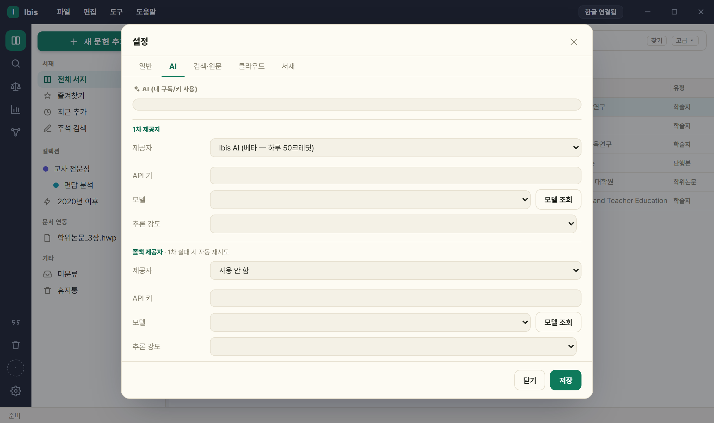

| 제공자 | 유형 | 필요 조건 |
|---|---|---|
| Claude CLI (구독) | 구독(키 불필요) | CLI 설치 + 1회 로그인 |
| Antigravity CLI (Google 구독) | Google 구독(키 불필요) | CLI 설치 + 1회 로그인 |
| Anthropic API 키 | API 키 | console.anthropic.com |
| OpenAI API 키 | API 키 | OpenAI |
| Gemini API 키 | API 키 | Gemini |
| ~~Codex CLI (향후 지원)~~ | — | **목록에 보이지만 고를 수 없습니다** |
| Ibis AI | 크레딧(키·CLI 불필요) | **구글 로그인**이 필요합니다(⚙설정 › 클라우드). 크레딧은 **하루 단위로 채워지고**(한국시간 오전 9시) 남은 양이 화면에 표시됩니다. ⚠ 제공자 목록에는 아직 `(준비 중 — 정식 릴리스 때 활성화)` 라고 적혀 있습니다 — 베타 기간의 표기입니다 |

- **Ibis AI 크레딧 (2026.9.2)** — 무겁게 쓰면 그만큼 나갑니다. **글자 수(토큰) 기준 종량제**라 짧은 요청은 적게, 수백 쪽 PDF 는 많이 듭니다. 그래서 **실행 전에 예상 크레딧을 먼저 보여 주고** 동의를 받습니다 — 남은 크레딧으로 모자라면 그 자리에서 알립니다.
- **모델** — **'모델 조회'** 버튼으로 그 제공자의 사용 가능 모델을 불러와 드롭다운에서 고릅니다(직접 입력도 가능). 비우면 CLI 는 '제공자 기본값' / API 는 내장 기본값(Anthropic `claude-haiku-4-5-20251001` · OpenAI `gpt-4o-mini` · Gemini `gemini-2.0-flash`).
- **추론 강도(선택)** — claude-cli 5단계(low/medium/high/xhigh/max) · antigravity-cli 3단계. API 제공자에는 노출되지 않습니다.
- **폴백 제공자(선택)** — 1차 실패 시 지정 제공자로 1회 자동 재시도(폴백도 제공자·모델·추론 강도를 따로 지정). 폴백 셀렉트 맨 앞은 **`사용 안 함`** 입니다.

**CLI 설치·로그인** — '설치' 버튼 → **1 설치 → 2 로그인 → 3 확인** 3단계 안내.

- 설치는 **별도 콘솔 창**에서 진행됩니다(무엇을 묻는지·왜 실패했는지 보이도록). 창을 기다리지 않고 앱이 3초 간격으로 확인합니다.
- 각 벤더의 **공식 설치 방법** 사용 — Claude Code 는 Node.js 없이 설치되는 네이티브 설치.
- **최초 1회 로그인 필요** — '로그인 창 열기' → 콘솔에서 CLI 실행 → 브라우저 인증. 콘솔이 있어야 끝낼 수 있어 창을 숨기지 않습니다.
- 설치 직후 **앱 재시작 불필요**(레지스트리 PATH·공식 설치 위치를 다시 확인).
- ⚠ '항상 위 고정' 이면 콘솔이 뒤에 열릴 수 있습니다 — 작업표시줄 확인.

오류 안내:

- **429** 사용량·속도 제한 → 잠시 후 재시도·다른 제공자/모델·폴백.
- **401/403** 인증·키 오류 · **400** 모델명 확인.
- 구 `gemini-cli` 설정은 `antigravity-cli` 로 자동 매핑.
- Antigravity(agy)는 stdin 을 읽지 않아 본문을 약 25,000자까지만 전달합니다(Windows 인자 한도).

---

## 9. 설정·API 키

`⚙설정`(톱니)은 **일반 · AI · 검색·원문 · 클라우드 · 라이브러리** 5개 탭입니다. 레일 맨 아래 ⚙ 로 엽니다.

| 탭 | 무엇이 있나 |
|---|---|
| **일반** | 문서 연결([2절](#2-한글word-문서-연결)) · 인용 스타일([5절](#5-참고문헌인용-스타일)) · 표시(테마·글꼴·항상 위 — [9.7](#97-테마--글꼴--항상-위-고정)) |
| **AI** | 제공자·모델·추론 강도·폴백 + **일괄 작업 동시 실행**([8.4](#84-ai-제공자모델폴백)) |
| **검색·원문** | ScienceON 인증키·이메일([9.1](#91-api-키이메일-발급)) · 도서관 원문([9.4](#94-도서관-교외접속프록시-경유-설정)) |
| **클라우드** | 구글 로그인 · 공유 중인 컬렉션 목록 · 서버 사용량([6.10](#610-컬렉션-공유)) |
| **라이브러리** | 라이브러리 위치·백업·업데이트 확인([9.6](#96-라이브러리-위치클라우드-폴더-동기화)) |

> **도구 패널은 없앴습니다.** 그 안에 있던 것은 이렇게 갈라졌습니다 — 가져오기·내보내기·컬렉션 공유는 `파일` 메뉴, 일괄 정리(중복·원문·AI 태그·첨부 이름)는 `도구` 메뉴, DOI·ISBN 추가는 `새 문헌 추가` 창의 **식별자로 채우기**, 라이브러리 위치·백업·업데이트 확인과 클라우드 로그인은 `⚙설정` 입니다. 예전 안내를 보고 도구 패널을 찾고 계셨다면 위 자리를 보세요.

설정 칸은 대부분 **'빈 칸은 유지' 규칙**이라 비우고 저장해도 지워지지 않습니다(삭제는 '지움' 버튼).

### 9.1 API 키·이메일 발급

*(⚙설정 › 검색·원문 탭. **KCI·국립중앙도서관은 앱 내장 키로 동작해 입력 칸이 없습니다** — 아래가 남은 전부입니다.)*

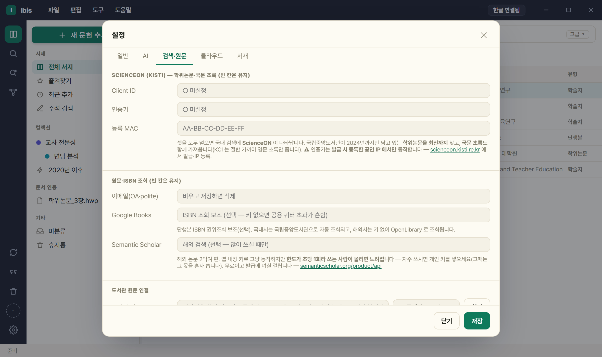

| 항목 | 발급처 · 절차 | 입력 칸 | 문의 |
|---|---|---|---|
| **ScienceON** | `scienceon.kisti.re.kr` 로그인 → 인증키 발급 신청 → **Client ID·인증키·등록 MAC 3개** | `Client ID` · `인증키` · `등록 MAC` | helpdesk@kisti.re.kr · 080-969-4114 |
| **이메일(OA·polite)** | 발급 아님. 본인 이메일(Unpaywall + Crossref/OpenAlex polite pool) | `이메일(OA·polite)` | — |
| **Google Books** | 발급 선택 — Google Cloud 콘솔의 Books API 키(단행본 ISBN 조회 보조) | `Google Books` | — |
| **도서관 원문 연결** | 발급 아님. 기관 프록시·도서관 홈 주소([9.4](#94-도서관-교외접속프록시-경유-설정)) | `도서관 경유 URL` · `도서관 홈페이지` + `로그인 열기` · 체크박스 `원문 열기 시 항상 도서관 경유` | — |

- **ScienceON** — **세 값이 모두** 있어야 동작(등록 MAC 하나만 빠져도 검색 불가). MAC 형식은 `AA-BB-CC-DD-EE-FF`.
- ⚠ **ScienceON 은 발급 시 등록한 공인 IP 에서만** 동작합니다. 넣지 않아도 앱은 온전히 동작합니다.
- **이메일 칸은 예외** — 비우고 저장하면 삭제됩니다. Unpaywall·Crossref 두 값에 같은 주소가 저장됩니다.
- **Google Books** — 단행본 **ISBN 조회** 보조용(선택, [3.4](#35-isbn으로-단행본-추가)). 키 없이 쓰면 공용 쿼터 초과가 흔해 보조로만 씁니다. ISBN 권위조회 자체는 내장 키로 국립중앙도서관을 씁니다.
- **키를 하나도 넣지 않아도** KCI·국립중앙도서관·Crossref·OpenAlex·S2·arXiv·ERIC 로 검색됩니다.

### 9.2 저장된 키 삭제 — '지움'

1. 설정된 키는 `● 설정됨` 으로 표시되고 옆에 **'지움'** 버튼이 나타납니다.
2. '지움' → **'저장'** → 실제 삭제됩니다. ScienceON 키를 지우면 그 소스가 드롭다운에서 사라집니다(KCI·국립중앙도서관은 내장 키라 그대로 남습니다).

- 환경변수(`SCIENCEON_*`·`UNPAYWALL_EMAIL` 등)로 설정된 값은 외부 구성이라 UI 에서 지워지지 않습니다.

### 9.3 AI 제공자 설정

- ⚙설정 **AI 탭**. **1차 제공자**·**폴백 제공자**를 각각 지정하고, 제공자마다 **모델**('모델 조회'로 불러와 드롭다운에서 선택)과 **추론 강도**를 고릅니다 — 자세히는 [8.4](#84-ai-제공자모델폴백).

### 9.4 도서관 교외접속(프록시) 경유 설정

⚙설정 **검색·원문 탭**의 '도서관 원문 연결' 영역입니다.

1. **'도서관 경유 URL'** — 기관 프록시 주소(예: `https://proxy.knue.ac.kr/_Lib_Proxy_Url/`).
2. **'도서관 홈페이지'** — 로그인하는 도서관 홈 주소(예: `https://lib.knue.ac.kr/`).
3. **'로그인 열기'** 로 브라우저에서 먼저 한 번 로그인해 세션을 만듭니다.
4. 필요하면 **'원문 열기 시 항상 도서관 경유'** 체크(체크 즉시 저장됨).

형식은 **자동 인식**됩니다 — 교외에서 DB 를 눌렀을 때 나온 주소를 그대로 붙여넣으면 템플릿으로 변환합니다.

- 경로형: `…/_Lib_Proxy_Url/` → `{urlraw}` (대상이 경로 세그먼트로 들어감)
- 쿼리형: `…/login?url=` → `{url}` (대상을 URL 인코딩)
- ⚠ **호스트가 이미 치환된 주소**(`https://www-sciencedirect-com.proxy.○○.ac.kr/…`)는 넣지 마세요 — 리다이렉트 **결과**라 템플릿이 되지 못합니다. 도서관 DB 목록에서 **링크 주소 복사**로 원본을 얻으세요.

주의:

- **미로그인 시 프록시가 접근을 튕기므로 홈페이지 선(先)로그인이 필수**입니다.
- 로그인 정보는 저장하지 않습니다(브라우저 세션만 사용).
- 구독 DB 원문은 자동으로 받지 않고 **사용자가 브라우저에서 직접** 받습니다.
- KCI 무료 원문·Google Scholar 는 프록시에서 제외됩니다.

### 9.5 데이터·비밀정보 저장 위치

| 항목 | 기본 위치 | 클라우드 동기화 |
|---|---|---|
| 라이브러리(서지) | `%LOCALAPPDATA%\Ibis\library.json` | 폴더를 클라우드로 지정 시 O |
| 첨부 PDF | 라이브러리 폴더의 `attachments\` | 라이브러리를 따라감 |
| docstore(문서별 인용) | 라이브러리 폴더의 `docstore\` | 라이브러리를 따라감 |
| 저널 스타일 | 라이브러리 폴더의 `journal_styles\` | 라이브러리를 따라감 |
| 받은 글꼴 | `%LOCALAPPDATA%\Ibis\fonts\` | X (PC 로컬) |
| 비밀정보(API 키·테마·글꼴·AI) | `%LOCALAPPDATA%\Ibis\secrets.json` | **X (항상 로컬)** |

- 옛 폴더(`%LOCALAPPDATA%\hwp-endnote`)를 쓰던 사용자는 **첫 실행 때 파일 단위로 자동 이관**되므로 할 일이 없습니다.
- 비밀정보는 권한 `0o600` 으로 저장되며 항상 로컬 — **클라우드 라이브러리를 써도 API 키·테마·글꼴·AI 설정은 PC 마다 따로** 넣어야 합니다.
- **환경변수가 `secrets.json` 보다 우선**합니다(`SCIENCEON_*`·`UNPAYWALL_EMAIL`·`LIBRARY_PROXY_PREFIX/AUTO`·`LIBRARY_LOGIN_URL`·`IBIS_LIBRARY` 등).
- 라이브러리 경로 우선순위: env `IBIS_LIBRARY` > secrets `library_path` > 기본.
- 옛 환경변수 이름 `HWPENDNOTE_LIBRARY`·`HWPENDNOTE_BACKEND` **도 그대로 인정**됩니다(새 이름 `IBIS_LIBRARY`·`IBIS_BACKEND` 가 우선).
- `⚙설정 › 라이브러리 › '탐색기에서 보기'` 로 확인.

### 9.6 라이브러리 위치·클라우드 폴더 동기화

`⚙설정 › 라이브러리` 탭입니다(`파일` › '설정 › 라이브러리…' 로도 바로 열립니다).

| 버튼 | 동작 |
|---|---|
| **이 라이브러리 폴더 변경** | 현재 데이터(+첨부·docstore·저널 스타일)를 지정 폴더로 이전. 대상에 `library.json` 이 있으면 그것을 **채택**, 없으면 **복사·이전** |
| **새로 만들기** | 빈 폴더에 새 라이브러리 생성 후 전환(이미 있으면 오류) |
| **열기** | 다른 폴더의 기존 라이브러리에 **복사 없이 연결·전환**(없으면 오류) |
| **사본 저장(백업)** | 다른 폴더로 **복사만**(전환 안 함). 대상에 이미 있거나 현재와 같으면 오류 |

- '새로 만들기'·'열기' 는 전환 전에 현재 라이브러리를 자동 저장합니다.
- **여러 PC 공유** — 한 PC 에서 클라우드 폴더로 '이전' → 다른 PC 에서 '열기' 로 연결. 서지·첨부·docstore·저널 스타일까지 동기화(비밀정보 제외).

### 9.7 테마 · 글꼴 · 항상 위 고정

`⚙설정 › '일반' › 표시`.

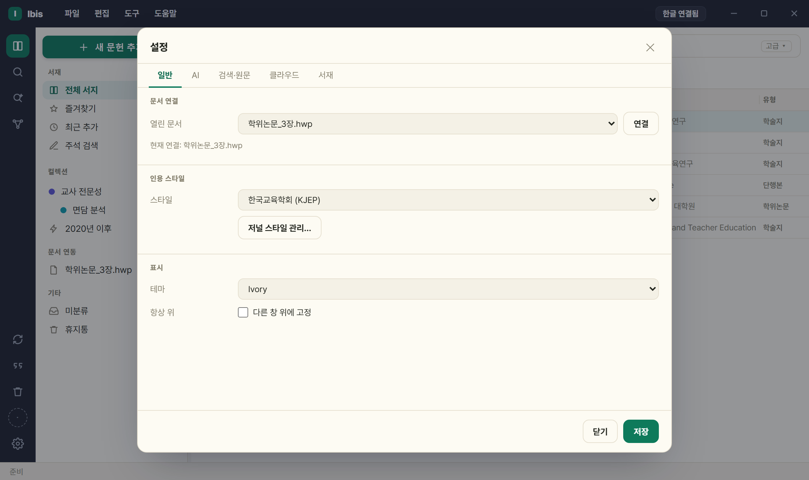

**테마 16종** — 고르는 즉시 열려 있는 모든 창에 적용되고 저장됩니다. 기본값은 **Ivory**(2026.8.2 부터 — 그전에 쓰시던 분의 테마는 그대로 유지됩니다).

- 자체 제작 4종: Slate · Ivory · Bright · Graphite → 타이틀바·레일이 **다크 고정**(원 디자인).
- 다크 8종: Dark Modern · One Dark Pro · Dracula · Nord · Monokai · Tokyo Night · Solarized Dark · GitHub Dark.
- 라이트 4종: Solarized Light · GitHub Light · Quiet Light · Ayu Light.
- 자체 제작 4종 외에는 **크롬(타이틀바·레일)까지 테마 색**을 따릅니다.

| | |
|---|---|
| 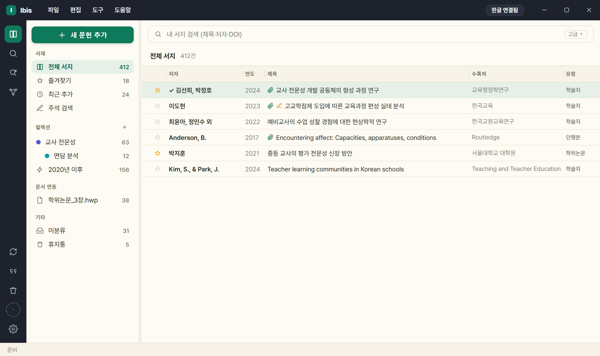 **Ivory — 기본**(종이톤·명조) | 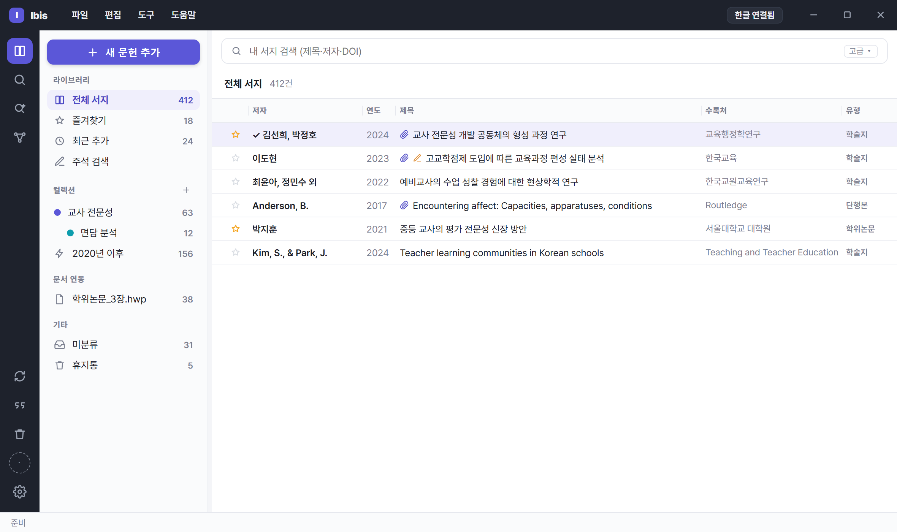 Slate |
| 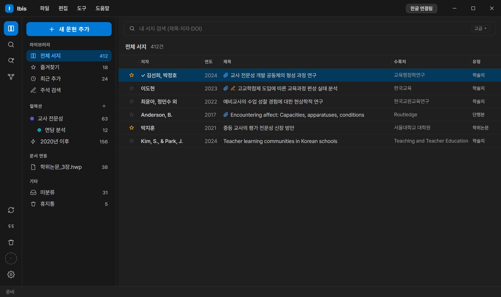 Dark Modern | 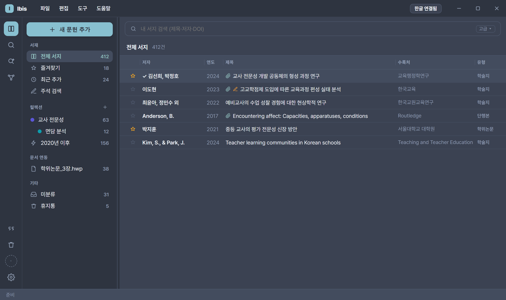 Nord |
| 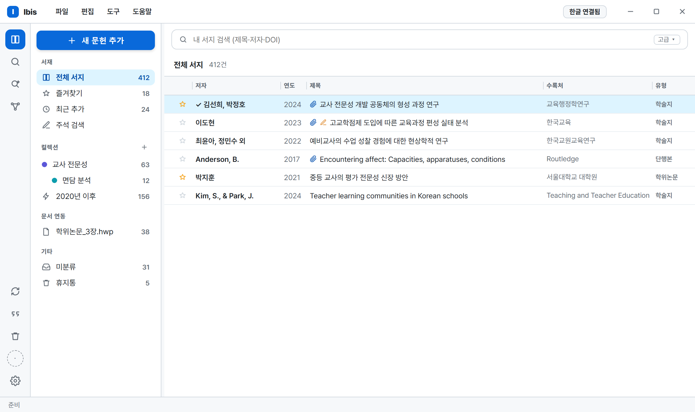 GitHub Light | 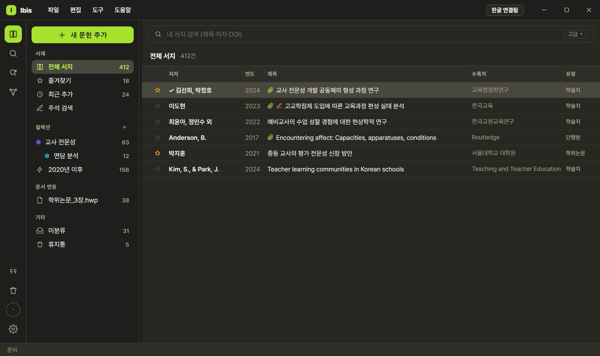 Monokai |

**글꼴** — 테마와 별개 설정. 테마가 어울리는 글꼴을 제안하고(종이톤 테마는 명조), 직접 고르면 **테마를 바꿔도 유지**됩니다.

- **글꼴 셀렉트의 '받아서 쓰는 글꼴' 4항목**: `Pretendard (기본)` · `본명조 Noto Serif KR` · `나눔고딕` · `고정폭 (나눔고딕코딩·JetBrains Mono)`.
  - ⚠ **Pretendard 는 설치본에 이미 들어 있어** 내려받을 필요가 없습니다.
- **'글꼴 받기' 내려받기 카탈로그 5종**: 본명조(22.7MB) · 나눔고딕(2.0MB) · 나눔명조(2.9MB) · 나눔고딕코딩(2.2MB) · JetBrains Mono(0.1MB).
  - 전부 SIL Open Font License 1.1 이며 **설치 파일에는 없습니다** — 필요한 것만 공식 배포처에서 내려받습니다(라이선스 사본도 함께 저장).
  - ⚠ **나눔명조는 카탈로그에만 있고 셀렉트 항목이 아닙니다.**
  - 보관 위치: `%LOCALAPPDATA%\Ibis\fonts` — 업데이트해도 남습니다.
- **시스템 설치 글꼴**: 맑은 고딕 · 함초롬돋움 · 함초롬바탕 — 라이선스상 파일을 포함하거나 대신 받아 줄 수 없어 **PC 에 설치돼 있을 때만** 쓰입니다.
- 받지 않은 글꼴을 골라도 화면은 깨지지 않습니다(설치된 글꼴로 자동 대체).

**항상 위 고정** — '다른 창 위에 고정' 체크 시 본창이 한글/Word 위에 유지됩니다.

- **저장되지 않아 재시작하면 해제**됩니다(매번 다시 체크).
- 본창에만 적용(설정·도구·그래프·상세·PDF 등 별도 창 제외).
- 별도 창(PDF·설정·도구)은 **화면 배율(125·150%)에서도 보고 있던 모니터 안에** 뜹니다(2026.8.0 에서 화면 밖으로 나가던 문제를 고쳤습니다).
- 테마·글꼴·항상 위 설정은 PC 로컬(`secrets.json`)이라 클라우드로 공유되지 않습니다.

### 9.8 온보딩을 건너뛰었다면

- 모든 항목(라이브러리 위치·이메일·AI, 그리고 온보딩에 없는 ScienceON·도서관 경유)은 `⚙설정` 에서 언제든 변경 가능.
- 이미 데이터가 있으면 온보딩 창은 다시 뜨지 않습니다.

### 9.9 도움말 › Ibis 정보 — 버전·저작권·라이선스

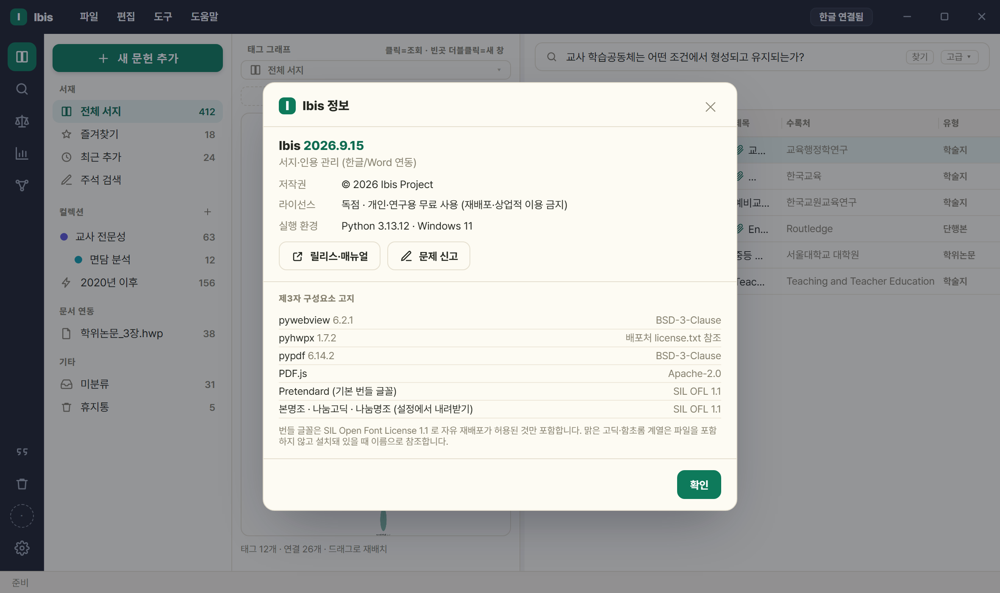

`도움말 › 'Ibis 정보 · 라이선스'` 에서 확인합니다.

- 표시 항목: 제품명·버전 · 저작권 · **배포 라이선스** · 실행 환경 · **제3자 구성요소 고지**(구성요소별 라이선스) · 릴리스·문제 신고 링크.
- Ibis 는 **개인·학술·연구·교육 목적 무료**이며 재배포·판매·유료 서비스 포함·역공학은 허용되지 않습니다(전문은 `LICENSE`).
- **Ibis 로 만든 서지 데이터와 문서는 전적으로 사용자의 것입니다.**
- 오픈소스 구성요소는 각자의 라이선스를 따르며, 번들 글꼴은 자유 재배포가 허용된 SIL OFL 1.1 만 포함합니다.

---

## 부록: 자주 묻는 요약

- **API 키 없이 쓸 수 있나요?** — 예. **KCI·국립중앙도서관까지 키 없이** 검색됩니다(내장 키). Crossref·OpenAlex·S2·arXiv·ERIC 도 무키이고, 인용 삽입·서지관리·스타일도 모두 가능. **ScienceON 만** 사용자 키가 필요합니다(선택).
- **여러 PC 에서 같은 서지를?** — 라이브러리 폴더를 클라우드로 지정하고 다른 PC 에서 '열기'. 단 API 키·테마·글꼴·AI 설정은 PC 마다 따로.
- **구독 DB 원문을 앱이 받아주나요?** — 아니요. 도서관 경유로 브라우저에 열어주기만 하고 다운로드는 사용자가 직접(받은 PDF 는 폴더 감시로 자동 첨부).
- **인앱 PDF 뷰어·주석은?** — 있습니다. 첨부 클릭 → 앱 안 뷰어, 형광펜·밑줄·메모(사이드카 동기화, '주석 검색'으로 전체 검색).
- **읽는 논문에 대해 AI 에게 물어볼 수 있나요?** — 예. PDF 창의 **'대화' 탭**이 그 논문 한 편만을 근거로 답하고, 답 속 `(p.쪽)` 을 누르면 근거 자리로 갑니다. 대화는 저장되지 않으니 남길 답만 [보관] 하세요([7.8](#78-pdf-창-대화-탭)).
- **AI 요약을 다시 돌리면 내 메모가 지워지나요?** — 아니요. 'AI 요약' 섹션과 직전 AI 태그·키워드만 교체하고 사용자 메모·수동 태그는 보존.
- **한글·Word 없이 쓸 수 있나요?** — 예. 독립 모드에서 검색·원문 확보·PDF 뷰어·AI·그래프·서지 관리가 모두 동작하고, 본문 인용만 막힙니다.
