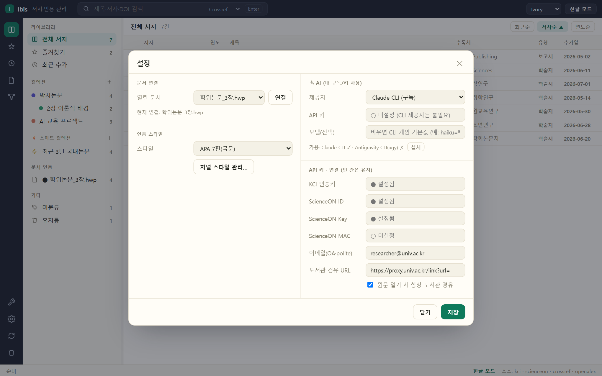
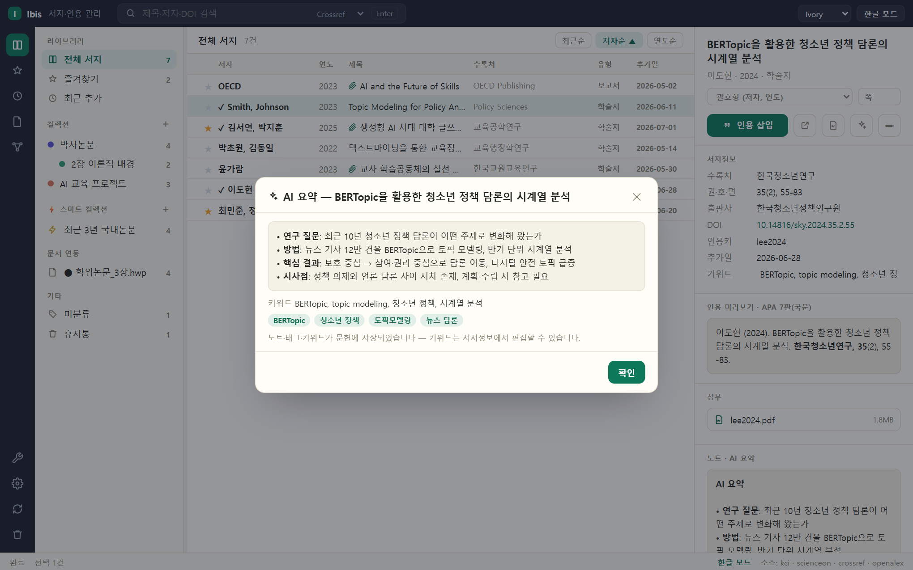
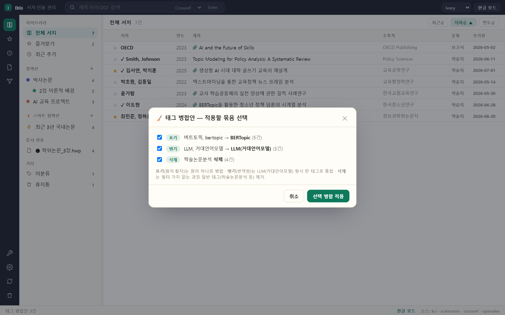
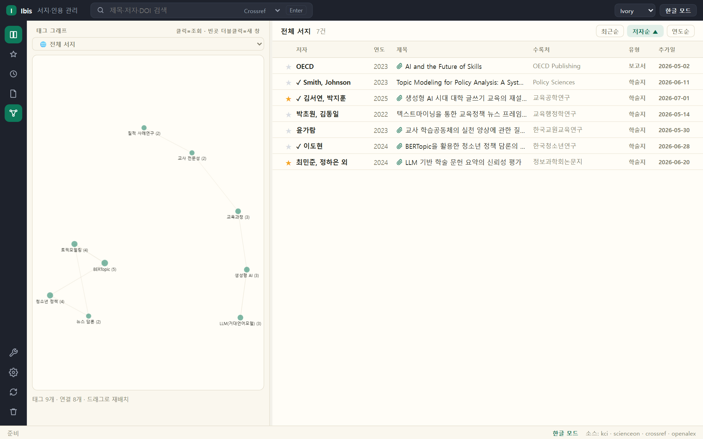
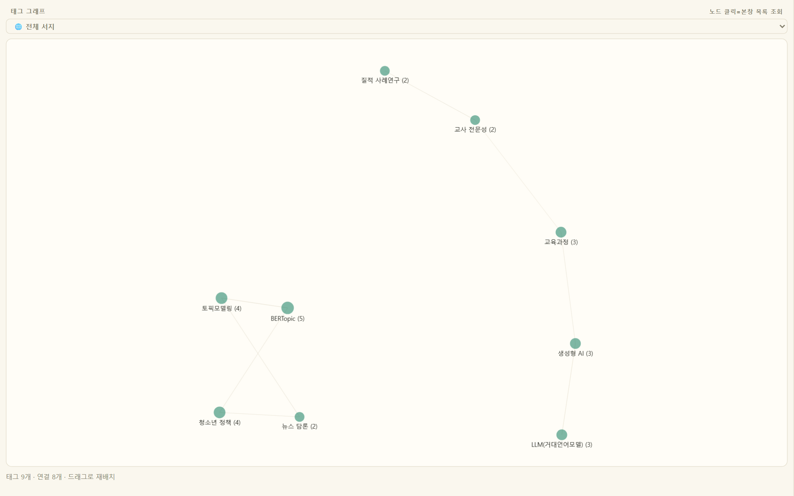
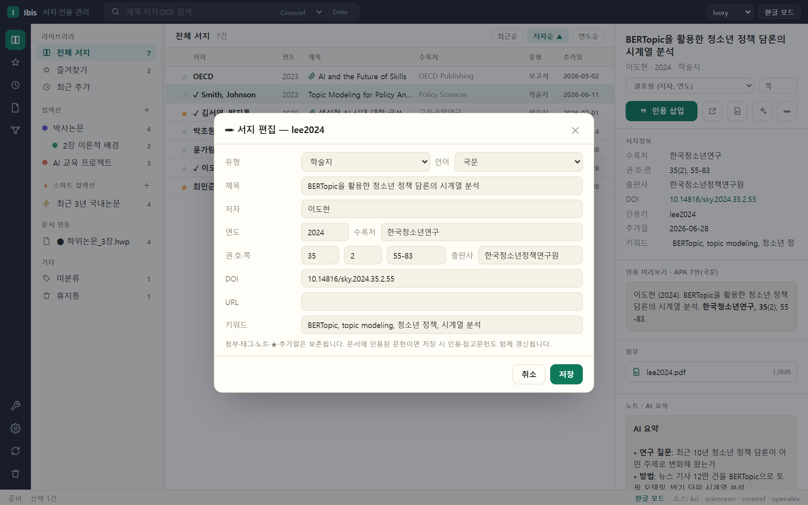

# Ibis 사용 설명서

> 이 문서는 최신 개발판 기준입니다. **✦ 표시 기능은 0.4.0 베타(새 웹 UI)부터** 제공되며,
> v0.3.0 다운로드판에서는 메뉴 위치·화면 구성이 일부 다를 수 있습니다.

## 목차
1. [시작하기 — 한글/Word 연결](#1-시작하기--한글word-연결)
2. [서지 수집 — 검색·DOI·가져오기](#2-서지-수집--검색doi가져오기)
3. [서지 정리 — 컬렉션·태그·휴지통](#3-서지-정리--컬렉션태그휴지통)
4. [인용 삽입과 참고문헌](#4-인용-삽입과-참고문헌)
5. [PDF 확보와 원문 열기](#5-pdf-확보와-원문-열기)
6. [AI 연구 도우미 ✦](#6-ai-연구-도우미-)
7. [태그 그래프 뷰 ✦](#7-태그-그래프-뷰-)
8. [서지 편집 ✦](#8-서지-편집-)
9. [키보드 단축키 ✦](#9-키보드-단축키-)
10. [문서 추적 — 파일명 변경·다른 PC](#10-문서-추적--파일명-변경다른-pc)
11. [데이터 관리와 백업](#11-데이터-관리와-백업)

---

## 화면 구성 한눈에

| 영역 | 내용 |
|---|---|
| 좌측 레일 | 전체 서지·즐겨찾기·최근·문서·그래프 뷰 전환, ⚙설정·갱신·휴지통 (아이콘 재클릭 = 사이드바 접기) |
| 사이드바 | 라이브러리 · 컬렉션(계층·색상) · ⚡스마트 컬렉션 · 문서 연동 · 미분류/휴지통 |
| 중앙 목록 | ★즐겨찾기 · ✓인용됨 · 📎첨부 표시, 최근/저자/연도 정렬(재클릭 = 오름/내림) |
| 우측 상세 | 서지정보(키워드 편집) · 인용 삽입 · 인용 미리보기 · 첨부 · 노트/AI 요약 · 태그 |

---

## 1. 시작하기 — 한글/Word 연결

- **한글이 이미 열려 있으면** Ibis 실행 시 자동으로 연결됩니다(상단 배지: `한글 모드`).
- **한글이 없으면 독립 모드**로 시작합니다 ✦ — 서지 수집·정리는 전부 가능하고,
  인용이 필요할 때 **⚙설정 → 문서 연결 → 연결**을 누르면 그때 한글이 실행·연결됩니다.
- 여러 문서를 열어 두었다면 ⚙설정 → 문서 연결에서 대상 문서를 고를 수 있습니다.
- 문서를 닫거나 전환하면 연결 상태가 자동으로 따라갑니다.

⚙설정: 문서 연결, 인용 스타일, AI 제공자, 검색 API 키·도서관 경유 URL을 한 곳에서 관리합니다.

> 한글 연동 중 "보안 모듈" 팝업이 나타나면 [FAQ](FAQ.md#한글-보안-모듈-팝업이-떠요)를 참고하세요.

## 2. 서지 수집 — 검색·DOI·가져오기

**검색.** 상단 검색창에 입력하고 소스를 고릅니다.

| 소스 | 특징 |
|---|---|
| 내 서지 | 제목·저자·수록처·태그·연도 전문 검색 |
| KCI | 국내 등재지 — [API 키 필요](FAQ.md#kciscienceon-api-키는-어떻게-받나요) |
| ScienceON | KISTI 통합(국내 학위논문 포함) — API 키 필요 |
| Crossref / OpenAlex / S2 / arXiv | 해외 학술 DB — 키 불필요 |
| ⚡멀티 | 여러 소스 동시 검색 |

**DOI 즉시 서지화.** 검색창에 `10.xxxx/...` 또는 `doi.org` URL을 붙여넣으면
소스와 무관하게 바로 서지로 해석됩니다.

**빠른 추가.** ⚙설정 → 도구 → *DOI로 추가*에 DOI만 넣어도 내 서지에 바로 들어옵니다.

**가져오기/내보내기.** ⚙설정 → 도구에서 BibTeX(.bib)·RIS·CSL-JSON을 가져오거나
내보낼 수 있습니다. 다른 서지 관리자(Zotero·EndNote)에서 옮겨올 때 사용하세요.

**중복 정리.** ⚙설정 → 도구 → *중복 문헌 정리* — 같은 문헌을 자동 탐지해 병합합니다.
첨부·태그·★·추가일은 병합 시 보존됩니다.

## 3. 서지 정리 — 컬렉션·태그·휴지통

**컬렉션.** 사이드바 *컬렉션* 옆 ＋로 생성합니다. 우클릭으로 **색상 지정·이름 변경·
하위 컬렉션 추가·삭제**를 할 수 있고, 문헌을 **드래그해서 떨어뜨리면** 배정됩니다.

**⚡스마트 컬렉션.** 조건(텍스트·저자·태그·연도 범위·유형)을 저장하면
조건에 맞는 문헌이 자동으로 모입니다. 우클릭으로 조건·색상 수정.

**복수 선택.** 마우스 드래그, `Ctrl`+클릭(개별), `Shift`+클릭(범위)으로 여러 문헌을
선택한 뒤 우클릭 메뉴에서 일괄 작업(인용·PDF 확보·AI 요약·컬렉션 배정·휴지통)을 실행합니다.

**휴지통.** 삭제한 문헌은 휴지통으로 이동하며(항상 확인 팝업), 복원 시 컬렉션 배정까지
되살아납니다. 휴지통에서의 삭제는 영구 삭제입니다(확인 필요).

**미분류.** 어떤 컬렉션에도 속하지 않은 문헌 모음 — 정리 대기열로 쓰세요.

## 4. 인용 삽입과 참고문헌

1. 문서에서 인용할 위치에 **커서**를 둡니다.
2. Ibis에서 문헌을 선택하고(복수 선택 = 병렬 인용) 형식을 고른 뒤 **인용 삽입**:
   - 괄호형 `(홍길동, 2024)` · 서술형 `홍길동(2024)` · 연도만 `(2024)`
   - 쪽수 입력 시 `(홍길동, 2024, 23)`
3. **참고문헌 갱신** — 문서 끝 새 페이지에 참고문헌 목록이 생성·정렬됩니다.
   서지를 수정했거나 인용을 지웠을 때도 이 버튼 하나로 전체가 다시 맞춰집니다.

세부 동작:
- 인용은 한글 **누름틀**(Word: 콘텐츠 컨트롤)로 들어가므로 일반 텍스트처럼 깨지지 않습니다.
- 나란히 붙은 인용은 갱신 시 자동으로 **병렬 인용** `(김철수, 2026; 황지은, 김동일, 2022)`으로 합쳐집니다 ✦
- 참고문헌은 내어쓰기·국문/영문 혼합 정렬·학술지명 강조 등 학회 서식을 따릅니다.
- 인용 스타일은 ⚙설정 → 인용 스타일에서 변경합니다.

> **원칙 — 단일 출처**: 문서의 인용 서지는 항상 "내 서지" 데이터를 기준으로 갱신됩니다.
> 내 서지에서 오탈자를 고치면 갱신 시 문서의 인용·참고문헌에 그대로 반영됩니다.

## 5. PDF 확보와 원문 열기

- **📥 PDF 자동 첨부**(문헌별) / **📥 PDF 일괄 확보**(⚙설정 → 도구): 합법적 무료 공개본만
  탐색합니다 — arXiv → Unpaywall → Semantic Scholar 순. 결과는 브리핑 팝업으로 요약됩니다.
  - Unpaywall은 이메일을 ⚙설정에 넣으면 활성화되어 확보율이 올라갑니다.
- 확보 실패(구독 DB 논문)는 **🏛 도서관 경유로 열기**를 쓰세요 — ⚙설정에 소속 기관의
  프록시 주소를 넣으면 교외에서도 기관 구독으로 원문에 접근합니다.
- 첨부가 있는 문헌은 목록에 📎이 표시되고, 상세 패널에서 바로 열 수 있습니다.

## 6. AI 연구 도우미 ✦

**내 자원을 씁니다** — Ibis는 AI 서버를 운영하지 않습니다. 다음 중 하나를 연결하세요
(⚙설정 → AI):

| 제공자 | 조건 | 비고 |
|---|---|---|
| Claude CLI | Claude 구독(Pro/Max) | 미설치 시 설정에서 안내·자동 설치 |
| Antigravity CLI | Google 계정 | `agy` — 구 Gemini CLI 후속 |
| Anthropic / OpenAI / Gemini API | 본인 API 키 | 키는 내 PC에만 저장 |

**AI 요약.** 문헌의 ✦ 버튼(또는 우클릭 → AI 요약, 복수 선택 = 일괄 요약):
첨부 PDF를 읽고 ① 연구 질문 ② 방법 ③ 핵심 결과 ④ 시사점을 요약해 **노트**에 저장하고,
**분류 태그**(주제·방법·대상 면별 추출)와 **논문 키워드**(서지 정보)를 자동 등록합니다.
BERTopic·LLM 같은 기술 용어는 원어로 표기됩니다.

요약·키워드·태그가 한 번에 생성되어 문헌에 저장됩니다.

**🧹 AI 태그 정리**(⚙설정 → 도구). 태그가 쌓이면 실행하세요 — AI가 제안하고,
적용할 묶음만 체크해서 반영합니다:
- **표기**: 버트토픽, bertopic → `BERTopic` (음차·철자 변형 병합)
- **병기**: LLM, 거대언어모델 → `LLM(거대언어모델)` (번역쌍을 한 태그로)
- **삭제**: `학술논문분석`처럼 필터 가치가 없는 과잉 일반 태그 제거

AI는 제안만 하고, 체크한 묶음만 적용됩니다.

## 7. 태그 그래프 뷰 ✦

좌측 레일의 그래프 아이콘으로 켭니다. **노드 = 태그**(크기 = 문헌 수, 라벨에 개수 표시),
**연결선 = 같은 문헌에 함께 등장**.

- 노드 **클릭** → 해당 태그의 문헌이 중앙 목록에 표시
- 노드 **드래그**로 재배치(주변이 동적으로 반응), **휠 = 줌**, 빈 공간 **드래그 = 이동**
- 노드 **호버** → 이웃 태그만 하이라이트 · 노드 **우클릭** → 태그 이름 변경·병합/삭제
- **빈 공간 더블클릭 → 별도 그래프 창**(크게 보기) — 그 창에서 노드를 클릭하면 본창 목록이 이동
- 스코프 선택: 전체 서지 / 컬렉션 / ⚡스마트 / 📄문서별
- 태그가 없다면 먼저 AI 요약을 실행하세요 — 태그가 자동 생성됩니다.

빈 공간 더블클릭으로 여는 별도 그래프 창 — 노드를 클릭하면 본창 목록이 이동합니다.

## 8. 서지 편집 ✦

문헌 선택 → 상세 패널의 **✏ 버튼**(또는 우클릭 → 서지 편집, 단축키 `F2`):
유형·언어·제목·저자·연도·수록처·권/호/쪽·출판사·DOI·URL·논문 키워드를 수정합니다.

- 저자는 세미콜론으로 구분: `홍길동; Smith, John`
- 첨부·태그·노트·★·추가일은 그대로 보존됩니다.
- **문서에 인용된 문헌이면 저장 즉시 문서의 인용·참고문헌도 함께 갱신**됩니다.

## 9. 키보드 단축키 ✦

| 키 | 동작 |
|---|---|
| `Delete` | 일반 뷰: 확인 후 휴지통 · **컬렉션 뷰: 그 컬렉션에서만 제외** · 휴지통: 확인 후 영구 삭제 |
| `Enter` | 선택 문헌 인용 삽입(더블클릭과 동일) |
| `F2` / `Ctrl+E` | 서지 편집 |
| `Ctrl+A` | 목록 전체 선택 |
| `↑` `↓` (+`Shift`) | 행 이동(범위 확장) |
| `Ctrl+F` / `/` | 검색창 포커스 |
| `Esc` | 팝업 닫기 → 선택 해제 |

## 10. 문서 추적 — 파일명 변경·다른 PC

문서에는 눈에 안 보이는 **문서 식별자(UUID)**가 심어집니다. 그래서:
- 문서 **파일명을 바꿔도** 인용·참고문헌 관리가 이어집니다.
- 라이브러리 폴더를 동기화(OneDrive 등)하면 **다른 PC에서 같은 문서**를 열어도
  이어서 작업할 수 있습니다.
- 사이드바 *문서 연동*에는 지금 열려 있는 문서만 표시되고, 문서를 닫으면 자동으로 사라집니다.

## 11. 데이터 관리와 백업

- **라이브러리 폴더 열기**(⚙설정 → 도구)로 저장 위치를 확인하세요.
  서지(JSON)·첨부 PDF가 이 폴더에 있습니다 — 이 폴더만 백업하면 됩니다.
- API 키 등 비밀값은 라이브러리와 분리된 로컬 설정에 저장되며 동기화되지 않습니다.
- 내보내기(CSL-JSON)를 주기적으로 받아 두면 이중 백업이 됩니다.
