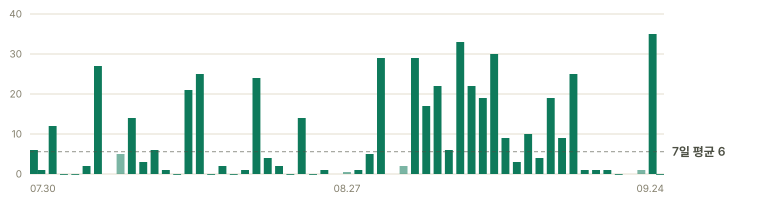

# 다운로드 추이

- 기록 시작 **2026-07-29** · 최신 스냅숏 **2026-09-12** · 스냅숏 43개
- 이 파일은 매일 자동 생성됩니다. 원본은 [`downloads.csv`](downloads.csv).

## 누적

| 구분 | 누적 | 전일 대비 |
|---|---:|---:|
| 설치 프로그램 (새 설치에 가깝다) | 30 | +2 |
| 무설치 zip (+ 인앱 업데이트) | 72 | +4 |
| 체크섬 (앱이 켜질 때마다 1 — 아래 '사용 현황') | 430 | +10 |
| **합계** | **532** | |

## 사용 현황 — 일별 실행 추정

<picture>
  <source media="(prefers-color-scheme: dark)" srcset="runs-dark.svg">
  
</picture>

- 최근 7일 평균 **하루 18회** · 전체 기간 평균 하루 10회 · 마지막 관측 **10회**(2026-09-12)
- **실행 횟수이지 사람 수가 아니다.** 한 사람이 하루 세 번 켜면 3으로 잡힌다.
- 앱은 켜질 때 업데이트를 확인하고, 그 과정에서 `.sha256` 을 실제로 내려받는다 — 업데이트가 없어도 받는다. 그래서 이 계열이 곧 실행 횟수다.
- 스캐너·크롤러도 자산을 훑으므로 **상한으로** 읽는다. 옅은 막대는 스냅숏이 빠진 구간을 날수로 나눈 값이라 관측이 아니라 배분값이다.
- 사람 수를 알 길은 아직 없다. 앱은 아무것도 보내지 않고(공개 README 의 약속), 클라우드는 로그인한 사람만 보이는데 그 수가 아직 개발 계정뿐이다.

## 일별 증가

| 날짜 | 설치 | zip | 합계 |
|---|---:|---:|---:|
| 2026-07-30 | +1 | +1 | +2 |
| 2026-07-31 | +0 | +0 | +0 |
| 2026-08-01 | +0 | +0 | +0 |
| 2026-08-02 | +0 | +0 | +0 |
| 2026-08-03 | +0 | +0 | +0 |
| 2026-08-04 | +0 | +0 | +0 |
| 2026-08-05 | +0 | +1 | +1 |
| 2026-08-07 | +1 | +1 | +2 |
| 2026-08-08 | +4 | +1 | +5 |
| 2026-08-09 | +0 | +1 | +1 |
| 2026-08-10 | +0 | +1 | +1 |
| 2026-08-11 | +0 | +1 | +1 |
| 2026-08-12 | +0 | +0 | +0 |
| 2026-08-13 | +0 | +1 | +1 |
| 2026-08-14 | +0 | +3 | +3 |
| 2026-08-15 | +0 | +0 | +0 |
| 2026-08-16 | +0 | +0 | +0 |
| 2026-08-17 | +0 | +0 | +0 |
| 2026-08-18 | +1 | +0 | +1 |
| 2026-08-19 | +0 | +4 | +4 |
| 2026-08-20 | +0 | +2 | +2 |
| 2026-08-21 | +0 | +1 | +1 |
| 2026-08-22 | +0 | +0 | +0 |
| 2026-08-23 | +0 | +0 | +0 |
| 2026-08-24 | +0 | +0 | +0 |
| 2026-08-25 | +0 | +0 | +0 |
| 2026-08-27 | +0 | +0 | +0 |
| 2026-08-28 | +0 | +0 | +0 |
| 2026-08-29 | +0 | +0 | +0 |
| 2026-08-30 | +0 | +2 | +2 |
| 2026-09-01 | +0 | +1 | +1 |
| 2026-09-02 | +1 | +3 | +4 |
| 2026-09-03 | +0 | +1 | +1 |
| 2026-09-04 | +1 | +4 | +5 |
| 2026-09-05 | +0 | +0 | +0 |
| 2026-09-06 | +3 | +6 | +9 |
| 2026-09-07 | +1 | +4 | +5 |
| 2026-09-08 | +1 | +4 | +5 |
| 2026-09-09 | +3 | +4 | +7 |
| 2026-09-10 | +2 | +1 | +3 |
| 2026-09-11 | +1 | +1 | +2 |
| 2026-09-12 | +2 | +4 | +6 |

## 누적 그래프

<picture>
  <source media="(prefers-color-scheme: dark)" srcset="downloads-dark.svg">
  
</picture>

> 설치 프로그램은 **새로 설치한 사람**에 가깝고, zip 은 **인앱 업데이트**가 섞입니다.

## 릴리스별 (최신 스냅숏)

| 릴리스 | 설치 | zip |
|---|---:|---:|
| v2026.9.7 | 3 | 4 |
| v2026.9.13 | 3 | 3 |
| v2026.9.12 | 2 | 4 |
| v2026.9.8 | 2 | 4 |
| v2026.8.1 | 4 | 2 |
| v2026.7.1 | 2 | 4 |
| v2026.7.2 | 2 | 3 |
| v2026.8.4 | 1 | 3 |
| … 외 39개 | | |

