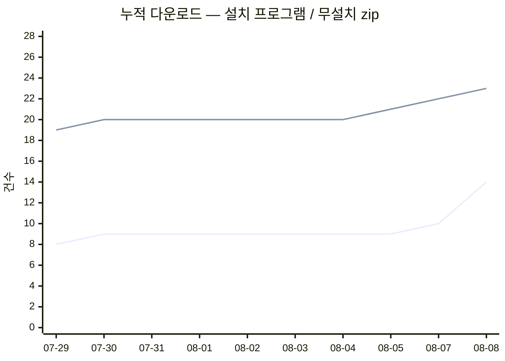

# 다운로드 추이

- 기록 시작 **2026-07-29** · 최신 스냅숏 **2026-08-08** · 스냅숏 10개
- 이 파일은 매일 자동 생성됩니다. 원본은 [`downloads.csv`](downloads.csv).

## 누적

| 구분 | 누적 | 전일 대비 |
|---|---:|---:|
| 설치 프로그램 (새 설치에 가깝다) | 14 | +4 |
| 무설치 zip (+ 인앱 업데이트) | 23 | +1 |
| 체크섬 파일 (사람 수 아님) | 86 | +14 |
| **합계** | **123** | |

## 일별 증가

| 날짜 | 설치 | zip | 합계 |
|---|---:|---:|---:|
| 2026-07-30 | +1 | +1 | +2 |
| 2026-07-31 | +0 | +0 | +0 |
| 2026-08-01 | +0 | +0 | +0 |
| 2026-08-02 | +0 | +0 | +0 |
| 2026-08-03 | +0 | +0 | +0 |
| 2026-08-04 | +0 | +0 | +0 |
| 2026-08-05 | +0 | +1 | +1 |
| 2026-08-07 | +1 | +1 | +2 |
| 2026-08-08 | +4 | +1 | +5 |

## 누적 그래프

> 설치 프로그램은 **새로 설치한 사람**에 가깝고, zip 은 **인앱 업데이트**가 섞입니다.

## 릴리스별 (최신 스냅숏)

| 릴리스 | 설치 | zip |
|---|---:|---:|
| v2026.7.1 | 2 | 4 |
| v2026.8.1 | 4 | 1 |
| v2026.7.2 | 2 | 3 |
| v0.7.0 | 1 | 3 |
| v0.6.2 | 3 | 1 |
| v2026.8.0 | 1 | 1 |
| v2026.7.0 | 0 | 1 |
| v0.7.2 | 0 | 1 |
| … 외 15개 | | |

